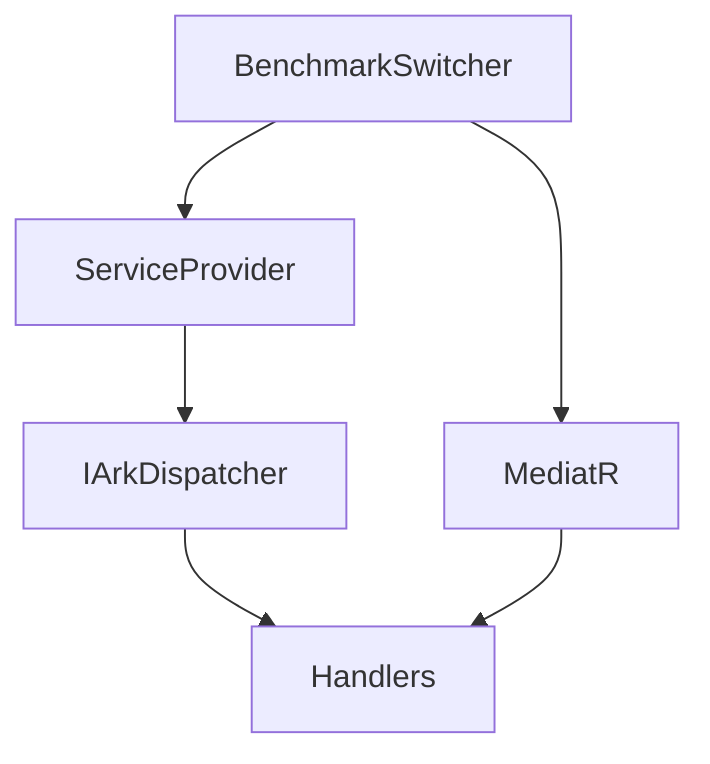
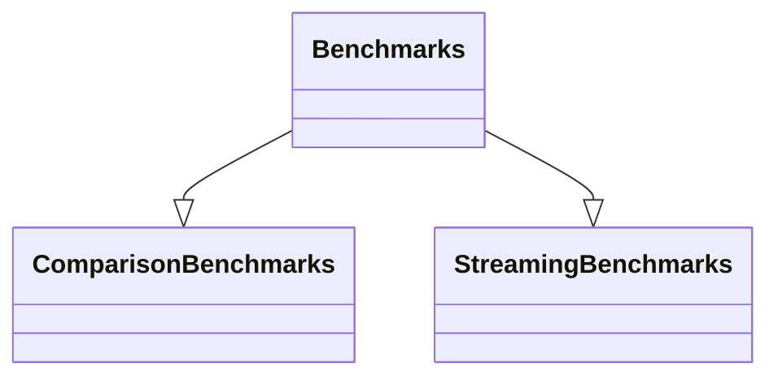
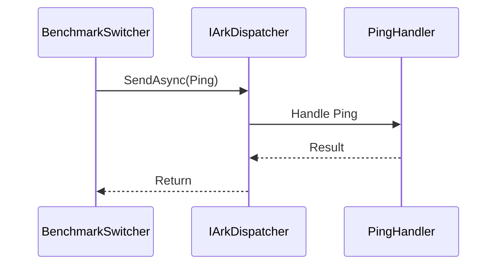

# Ark.Alliance.Core.Mediator.Benchmarks

## Table of Contents
- [Summary](#summary)
- [Main Features](#main-features)
- [Use Cases](#use-cases)
- [Project Structure](#project-structure)
- [Functional Diagram](#functional-diagram)
- [Class Diagram](#class-diagram)
- [UML Sequence Diagram](#uml-sequence-diagram)
- [Code Examples](#code-examples)
- [Table of Components](#table-of-components)
- [Dependencies](#dependencies)
- [Licenses and Acknowledgments](#licenses-and-acknowledgments)
- [Release](#release)
- [Author and Reference Date](#author-and-reference-date)

## Summary
`Ark.Alliance.Core.Mediator.Benchmarks` uses **BenchmarkDotNet** to measure the performance of the custom dispatcher against the popular MediatR library. It includes scenarios for commands, events and streaming requests, providing reproducible metrics for throughput and memory usage. These benchmarks highlight the benefits of compile-time registration and lightweight middleware compared to reflection-based approaches.

## Main Features
- **Core Operations**
  - Executes micro benchmarks via `BenchmarkSwitcher`.
  - Compares `IArkDispatcher` with MediatR for send and publish operations.
- **Extended Features**
  - Streaming benchmark to evaluate `CreateStream` performance.
  - Optional dotTrace diagnoser for profiling.
  - Benchmarks use `AddHybridHandlers` so compile-time and runtime registrations are measured together.

- **Service-Specific**
  - Designed for the Ark Alliance ecosystem but runnable in any .NET 9 environment.

## Use Cases
- Validate the impact of source generators on dispatch speed.
- Compare middleware overhead with MediatR pipelines.
- Profile streaming scenarios for latency and allocation checks.

## Project Structure
```
Ark.Alliance.Core.Mediator.Benchmarks/
|-- Benchmarks.cs
|-- ComparisonBenchmarks.cs
|-- StreamingBenchmarks.cs
|-- GenericCommandMiddleware.cs
|-- GenericEventMiddleware.cs
|-- GenericPipelineBehavior.cs
|-- Program.cs
|-- Ark.Alliance.Core.Mediator.Benchmarks.csproj
```
### Compliance
- **DDD** – benchmarks operate on simple commands and events, isolating infrastructure concerns.
- **Event-Driven** – measures publish and streaming flows.
- **Clean Arch** – keeps benchmarking code separate from production libraries.

## Functional Diagram


## Class Diagram


## UML Sequence Diagram


## Code Examples
- **Run all benchmarks**
  ```bash
  dotnet run -c Release
  ```
  *Use case: execute from command line to capture performance metrics.*
- **Filter a specific benchmark**
  ```bash
  dotnet run -c Release --filter StreamingBenchmarks
  ```
  *Use case: focus on streaming performance only.*

- **Generate Markdown report**
  ```bash
  dotnet run -c Release
  ```
  *Appends results to `Benchmarks_Report.md` with date, time and branch name.*
  The report includes a comparison table showing MediatR and Ark Alliance
  Mediator timings with the percentage difference for each scenario.

## Table of Components
| Component | Description | Docs Link |
|-----------|-------------|----------|
| `Benchmarks` | Baseline send and publish tests | N/A |
| `ComparisonBenchmarks` | Side-by-side dispatcher vs. MediatR | N/A |
| `StreamingBenchmarks` | Measures async stream performance | N/A |

## Dependencies
- BenchmarkDotNet 0.13.10
- Microsoft.Extensions.DependencyInjection 9.0.6
- Microsoft.Extensions.Logging 9.0.6

## Licenses and Acknowledgments
This project is released under the [MIT License](../../LICENSE.txt). BenchmarkDotNet is licensed under MIT.

## Release
- 2025-07-23 Initial benchmark documentation.

## Author and Reference Date
- Author: Armand Richelet-Kleinberg
- Reference Date: July 23, 2025
