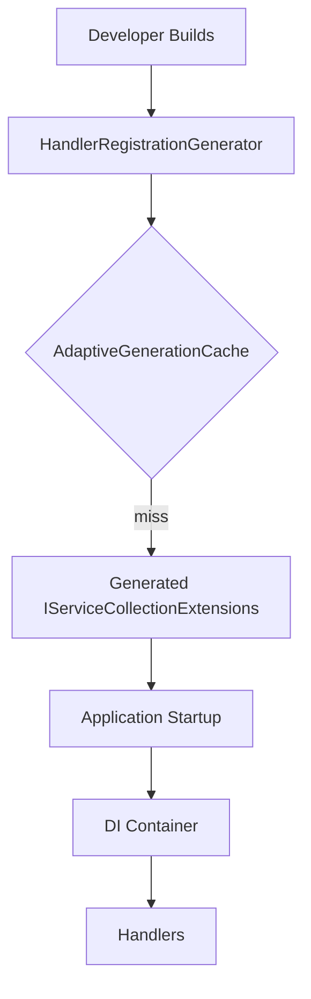
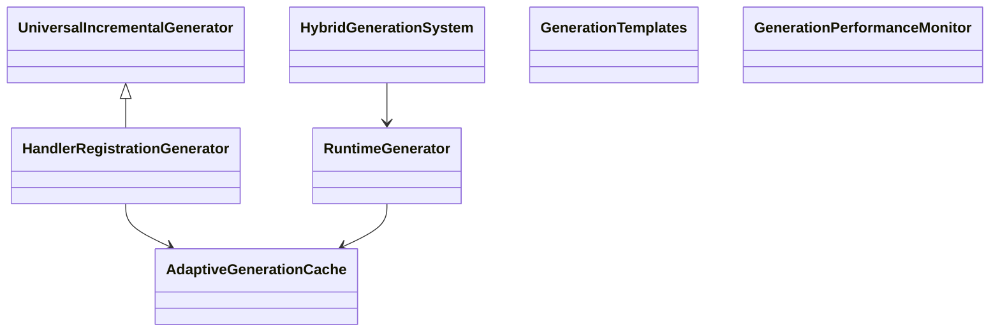
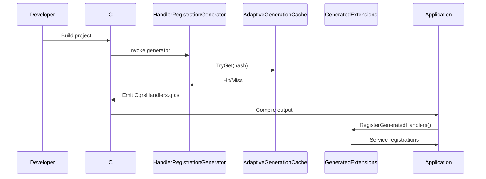

# Ark.Alliance.Core.Mediator.Generators

## Table of Contents
- [Summary](#summary)
- [Features](#features)
- [Use Cases](#use-cases)
- [Configuration](#configuration)
- [Project Structure](#project-structure)
- [Diagrams](#diagrams)
- [Code Examples](#code-examples)
- [Table of Components](#table-of-components)
- [Dependencies](#dependencies)
- [Licenses and Acknowledgments](#licenses-and-acknowledgments)
- [Release](#release)
- [Author and Reference Date](#author-and-reference-date)

## Summary
Ark.Alliance.Core.Mediator.Generators is a Roslyn source generator that emits compile-time service registrations for CQRS handlers. Unlike runtime reflection commonly used in traditional mediator libraries, this approach leverages the .NET 9 compiler to discover handlers and generate dependency injection code. The result is faster startup, reduced memory consumption and clear compile-time errors when handlers are missing. This tool complements the Ark.Alliance.Core.Mediator messaging stack used across microservices to keep applications lightweight and maintainable.

## Features
**Core**
  - Compile-time scanning of classes implementing `ICommandHandler`, `IQueryHandler`, `IEventHandler` or `IStreamRequestHandler`.
  - Generates a partial method `RegisterGeneratedHandlers` on `IServiceCollection`.
  - Built on the reusable **UniversalIncrementalGenerator** base with hash-based caching.
**Extensions**
  - Works transparently with `AddArkMessaging` helpers.
  - Optional cache modes: `None`, `Memory`, `File` and `Hybrid` via `.editorconfig` or environment variables.
  - Runtime generator for dynamic handler discovery.
  - `AddHybridHandlers` combines compile-time and runtime registrations.
  - Adaptive cache with memory and file persistence via `AdaptiveCacheConfiguration`.
  - Cache entries track last access time and access count.
  - Generic templates for service registration, mapping and expressions.
  - Performance helpers with object pooling and `GenerationPerformanceMonitor`.
  - `generator_optimizer.py` script to build optimized generators.
**Service-Specific**
  - Designed for the Ark Alliance ecosystem but reusable in any .NET&nbsp;9 project using Ark dispatcher contracts.

## Use Cases
- Improve cold-start performance of microservices by eliminating reflection when configuring dependency injection.
- Enforce compile-time validation for handler registrations, preventing runtime surprises in continuous deployment.
- Use in resource‑constrained CLI tools where reduced memory footprint is beneficial.

## Configuration
Caching behaviour is controlled with `.editorconfig` properties understood by the generator:

```ini
[*.cs]
build_property.ArkMediatorGeneratorCacheMode = Memory  # None|Memory|File|Hybrid
build_property.ArkMediatorGeneratorCacheFile = obj/ark_mediator_cache.txt
```
`Memory` keeps hashes only for the current compilation while `File` persists them across builds. `Hybrid` uses both in-memory and file caches. Use `None` to disable caching. Values may also be overridden via the environment variables `ARK_MEDIATOR_GENERATOR_CACHE_MODE` and `ARK_MEDIATOR_GENERATOR_CACHE_FILE` during build.

The cache loader and saver run asynchronously and log basic diagnostics when the build is run in <code>DEBUG</code> mode. This makes the generator responsive even with large cache files.

At runtime the registration helpers can also cache reflection-based discovery when `ArkMessagingOptions.ReflectionCache` is set to `Memory` or `File`. This avoids repeatedly scanning assemblies on startup.

## Project Structure
```
Ark.Alliance.Core.Mediator.Generators/
|-- HandlerRegistrationGenerator.cs    # Source generator logic
|-- Ark.Alliance.Core.Mediator.Generators.csproj
```
### Compliance
- **DDD** – respects separation of infrastructure by keeping generator logic out of runtime code.
- **Event-Driven** – targets command, query and event handler interfaces for automatic wiring.
- **Clean Arch** – produced registrations keep presentation and infrastructure layers independent.

## Diagrams
### Functional Diagram


### Class Diagram


### UML Sequence Diagram


## Code Examples
- **Enable generator via project reference**
  ```xml
  <ItemGroup>
    <ProjectReference Include="Ark.Alliance.Core.Mediator.Generators.csproj" OutputItemType="Analyzer" />
  </ItemGroup>
  ```
  *Use case: adds the generator at build time without shipping it in the final package.*
- **Automatic handler registration**
  ```csharp
  services.AddArkMessaging(typeof(Program).Assembly);
  // Generated RegisterGeneratedHandlers is invoked internally
  ```
  *Use case: microservice startup using compile-time registrations.*

- **Manual invocation if needed**
  ```csharp
  IServiceCollectionExtensions.RegisterGeneratedHandlers(services);
  ```
  *Use case: call the partial method directly in custom setups.*

- **Hybrid handler registration**
  ```csharp
  services.AddHybridHandlers(typeof(Program).Assembly);
  ```
  *Use case: fallback to runtime generation when compile-time handlers are missing.*

- **Generate custom service registrations**
  ```csharp
  var regs = new[]
  {
      ("IMyService", "MyService"),
      ("IYourService", "YourService")
  };
  var code = GenerationTemplates.ServiceRegistrationTemplate(
      "MyApp.Generated", regs);
  ```
  *Use case: emit lightweight DI extensions for any interface/implementation pairs.*

- **Dynamic mapping template**
  ```csharp
  var maps = new[]
  {
      ("User", "UserDto", "new UserDto { Name = source.Name }")
  };
  var mapCode = GenerationTemplates.MappingTemplate("MyApp.Generated", maps);
  ```
  *Use case: quickly produce mapping helpers without a third-party library.*

- **Expression template**
  ```csharp
  var exprs = new[]
  {
      ("User", "Display", "u => u.Name + \" (\" + u.Age + \")\"")
  };
  var exprCode = GenerationTemplates.ExpressionTemplate("MyApp.Generated", exprs);
  ```
  *Use case: compile property accessors for maximum runtime performance.*

- **Runtime generation**
  ```csharp
  using var runtime = new RuntimeGenerator();
  var src = await runtime.GenerateHandlerRegistrationsAsync(typeof(Program).Assembly);
  await runtime.CompileAndExecuteAsync<object>(src, "RegisterHandlers", new object[]{ services });
  ```
  *Use case: load plugins or late-bound handlers at runtime.*

## Table of Components
| Component | Description | Docs Link |
|-----------|-------------|----------|
| **HandlerRegistrationGenerator** | Scans handler implementations and generates DI extensions. | N/A |
| **RuntimeGenerator** | Produces registrations at runtime from loaded assemblies. | N/A |
| **HybridGenerationSystem** | Extension bridging compile-time and runtime generation. | N/A |
| **AdaptiveGenerationCache** | In-memory or file cache storing generation hashes. | N/A |
| **GenerationTemplates** | Helpers for building registration, mapping and expression code. | N/A |
| **GeneratedExtensions** | Partial class `IServiceCollectionExtensions` with registrations. | N/A |

## Dependencies
- Microsoft.CodeAnalysis.CSharp 4.8.0
- Microsoft.CodeAnalysis.Analyzers 4.14.0

## To-Do
| ID | Task | Status | Notes |
|----|------|--------|-------|
| 24 | Implement hash-based cache for generated registrations | Done | Supports `None`, `Memory`, `File` and `Hybrid` modes |
| 25 | Benchmark generator performance with caching | Open | Use BenchmarkDotNet to compare modes |
| 26 | Add unit tests verifying cache behaviour | Done | File, memory, hybrid and none modes covered |

## Licenses and Acknowledgments
Ark.Alliance.Core.Mediator.Generators is released under the [MIT License](../../LICENSE.txt). This README was partially generated with assistance from arkr (xAI) and manually reviewed for accuracy.

## Thanks
Guidance on caching strategies was drawn from the Roslyn repository and various blog discussions such as [dotnet/roslyn#65552](https://github.com/dotnet/roslyn/issues/65552).

## Release
- 2025-05-23 Initial documentation for Ark.Alliance.Core.Mediator.Generators.

Further SDLC notes for this generator are available under
[`_Sdlc`](./_Sdlc/README.md).

### Optimization Script


## Author and Reference Date
- Author: Armand Richelet-Kleinberg

