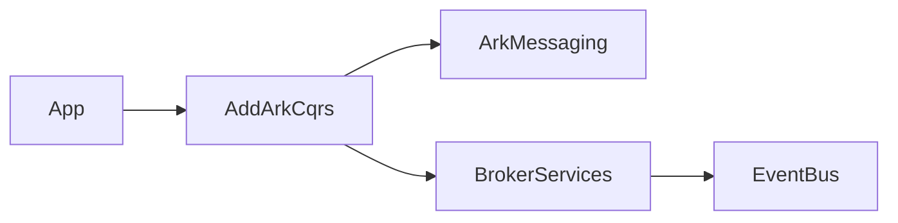
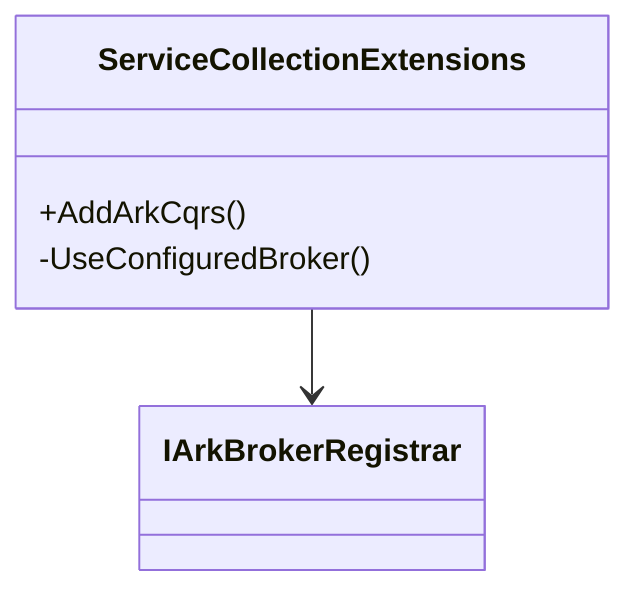
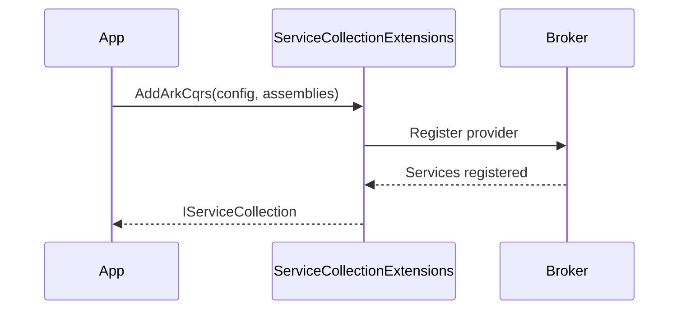

# Ark.Alliance.Core.Mediator.IoC

## Table of Contents
- [Summary](#summary)
- [Main Features](#main-features)
- [Use Cases](#use-cases)
- [Project Structure](#project-structure)
- [Functional Diagram](#functional-diagram)
- [Class Diagram](#class-diagram)
- [UML Sequence Diagram](#uml-sequence-diagram)
- [Code Examples](#code-examples)
- [Table of Components](#table-of-components)
- [Dependencies](#dependencies)
- [Licenses and Acknowledgments](#licenses-and-acknowledgments)
- [Release](#release)
- [Author and Reference Date](#author-and-reference-date)

## Summary
Ark.Alliance.Core.Mediator.IoC provides dependency injection helpers for the Ark messaging stack. The `AddArkCqrs` extension registers the dispatcher, handlers and broker services using configuration. It relies solely on the built‑in .NET 9 `IServiceCollection` and keeps services decoupled from specific frameworks. Loading broker providers dynamically allows applications to remain lightweight while enabling event‑driven integration.

## Main Features
- Register Ark dispatcher and all handlers from given assemblies.
- Configure broker providers through `ArkMessagingOptions` in configuration files.
- Optional logging middleware automatically included when enabled.
- Toggle reflection-based handler scanning via `HandlerRegistration` option.
- Simple extension method surface for quick bootstrapping of microservices.

## Use Cases
- Set up messaging and broker connectivity in ASP.NET Core or console apps.
- Switch brokers (RabbitMQ, ZeroMQ…) without changing application code.
- Enable logging and resilience policies through configuration only.

## Project Structure
```
Ark.Alliance.Core.Mediator.IoC/
|-- DependencyInjection/       # ServiceCollectionExtensions
|-- Ark.Alliance.Core.Mediator.IoC.csproj
|-- README.md
```
### Compliance
- **DDD** – keeps infrastructure concerns separated via DI extensions.
- **Event‑Driven** – broker registration enables publish/subscribe messaging.
- **Clean Architecture** – application code depends only on abstractions.

## Functional Diagram


## Class Diagram


## UML Sequence Diagram


## Code Examples
```csharp
var builder = WebApplication.CreateBuilder(args);
builder.Services.AddArkCqrs(builder.Configuration, typeof(Program).Assembly);
// Example: disable reflection scanning
// "Ark:Messaging:HandlerRegistration": "Generated"
// Enable retry middleware with two attempts and sequential event publishing
// "Ark:Messaging:EnableRetry": true
// "Ark:Messaging:RetryCount": 2
// "Ark:Messaging:EventPublisher": "Sequential"
// "Ark:Messaging:EnablePolly": true
// "Ark:Messaging:PollyRetryCount": 2
// "Ark:Messaging:EnablePipeline": true
// "Ark:Messaging:PipelineRetryCount": 2
```

## Table of Components
| Component | Description | Docs |
|-----------|-------------|------|
| `ServiceCollectionExtensions` | Registers dispatcher, handlers and broker via `AddArkCqrs` | [Source](DependencyInjection/ServiceCollectionExtensions.cs) |
| `IArkBrokerRegistrar` | Broker adapter contract loaded dynamically | [Messaging](../Ark.Alliance.Core.Mediator.Messaging/README.md) |

## Dependencies
- Microsoft.Extensions.DependencyInjection.Abstractions 9.0.6
- Ark.Alliance.Core.Mediator.Messaging (project reference)
- Ark.Alliance.Core.Mediator.Messaging.Abstractions (project reference)

## Licenses and Acknowledgments
- MIT License for this library
- Polly under MIT: https://github.com/App-vNext/Polly
- Microsoft.Extensions libraries under MIT: https://github.com/dotnet/runtime
- This README was partially generated with assistance from Grok by xAI and manually reviewed for accuracy.

## Release
- v1.0: Initial DI helpers with broker loading - July 2025

## Author and Reference Date
*Author: Armand Richelet-Kleinberg*

*Reference Date: July 22, 2025*
