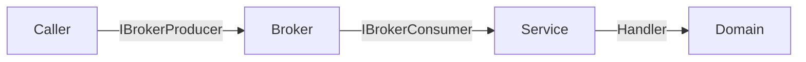
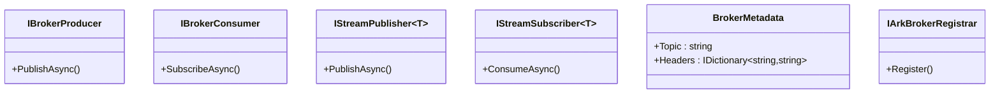
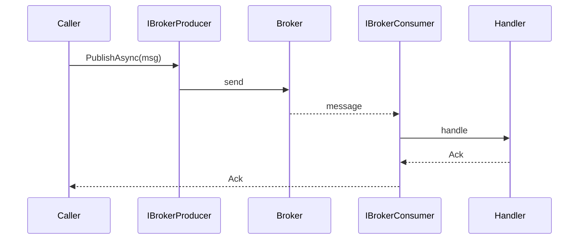

# Ark.Alliance.Core.Mediator.Messaging.Abstractions

## Table of Contents
- [Summary](#summary)
- [Main Features](#main-features)
- [Use Cases](#use-cases)
- [Project Structure](#project-structure)
- [Functional Diagram](#functional-diagram)
- [Class Diagram](#class-diagram)
- [UML Sequence Diagram](#uml-sequence-diagram)
- [Code Examples](#code-examples)
- [Table of Interfaces](#table-of-interfaces)
- [Dependencies](#dependencies)
- [Licenses and Acknowledgments](#licenses-and-acknowledgments)
- [Release](#release)
- [Author and Reference Date](#author-and-reference-date)

## Summary
Ark.Alliance.Core.Mediator.Messaging.Abstractions provides the minimal contracts used by the rest of the Ark Alliance messaging stack. It separates message brokers from business logic so services remain broker agnostic. Unlike tightly coupled integrations in monolithic applications, these interfaces allow microservices to swap brokers or introduce streaming without rewriting core logic.

The library follows principles from Domain‑Driven Design and Clean Architecture. Producers and consumers encapsulate publication and subscription details, while brokers can implement resilience and serialization strategies independently. This modular approach promotes easier maintenance and scaling compared to legacy frameworks where broker APIs are embedded directly in service code.

## Main Features
- **Core Operations**
  - `IBrokerProducer` publishes messages asynchronously.
  - `IBrokerConsumer` subscribes handlers to broker messages.
  - `BrokerMetadata` describes topics and headers for routing.
- **Extended Features**
  - `IStreamPublisher<T>` streams large message sequences with acknowledgements.
  - `IStreamSubscriber<T>` consumes streaming data from a topic.
- **Service Specific**
  - `IArkBrokerRegistrar` registers broker implementations through configuration.

## Use Cases
- Decouple services from RabbitMQ, ZeroMQ or other brokers.
- Stream large datasets between microservices with back‑pressure awareness.
- Configure different brokers per environment without code changes.
- Register custom broker adapters in dependency injection containers.

## Project Structure
```
Ark.Alliance.Core.Mediator.Messaging.Abstractions/
|-- Ack.cs                     # Publication acknowledgement enum
|-- BrokerContracts.cs         # Interfaces for producers, consumers and streaming
|-- SUMMARY.md                 # API summary reference
|-- Ark.Alliance.Core.Mediator.Messaging.Abstractions.csproj
```
### Compliance
- **DDD** – messaging abstractions are separated from concrete brokers.
- **Event‑Driven** – designed for publishing and subscribing to domain events.
- **Clean Arch** – consumers depend only on these interfaces, not on broker APIs.

## Functional Diagram


## Class Diagram


## UML Sequence Diagram


## Code Examples
- **Publish a message**
  ```csharp
  await producer.PublishAsync(new OrderCreated(), new BrokerMetadata("orders"));
  ```
- **Subscribe to a topic**
  ```csharp
  await consumer.SubscribeAsync<OrderCreated>(HandleOrderAsync);
  ```
- **Stream data**
  ```csharp
  await foreach (var ack in publisher.PublishAsync(source, ct))
      Log(ack);
  ```
- **Register via configuration**
  ```csharp
  registrar.Register(services, configuration.GetSection("Broker"));
  ```
- **Handle acknowledgements**
  ```csharp
  if (ack == Ack.Fail) HandleFailure();
  ```

## Table of Interfaces
| Interface | Description | Docs |
|-----------|-------------|------|
| `IBrokerProducer` | Publishes messages to an external broker. | [Summary](SUMMARY.md) |
| `IBrokerConsumer` | Subscribes handlers to broker messages. | [Summary](SUMMARY.md) |
| `IStreamPublisher<T>` | Streams items with acknowledgements. | [Summary](SUMMARY.md) |
| `IStreamSubscriber<T>` | Consumes items from a topic. | [Summary](SUMMARY.md) |
| `IArkBrokerRegistrar` | Registers broker services. | [Summary](SUMMARY.md) |

## Dependencies
- [Microsoft.Extensions.Configuration 9.0.6](https://www.nuget.org/packages/Microsoft.Extensions.Configuration)
- [Microsoft.Extensions.DependencyInjection.Abstractions 9.0.6](https://www.nuget.org/packages/Microsoft.Extensions.DependencyInjection.Abstractions)

## Licenses and Acknowledgments
- Released under the [MIT License](../../LICENSE.txt).
- Utilises [Microsoft.Extensions](https://github.com/dotnet/runtime) libraries under MIT.
- This README was partially generated with assistance from Codex by OpenAI and manually reviewed for accuracy.

## Release
- v1.0: Initial abstractions for producer/consumer and streaming - July 01, 2025

## Author and Reference Date
- Author: Armand Richelet-Kleinberg
- Reference Date: July 01, 2025
