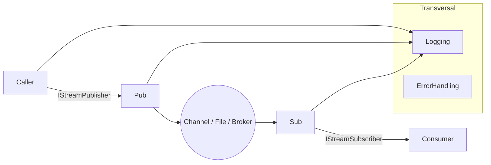
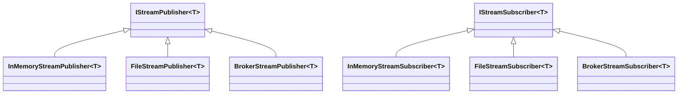
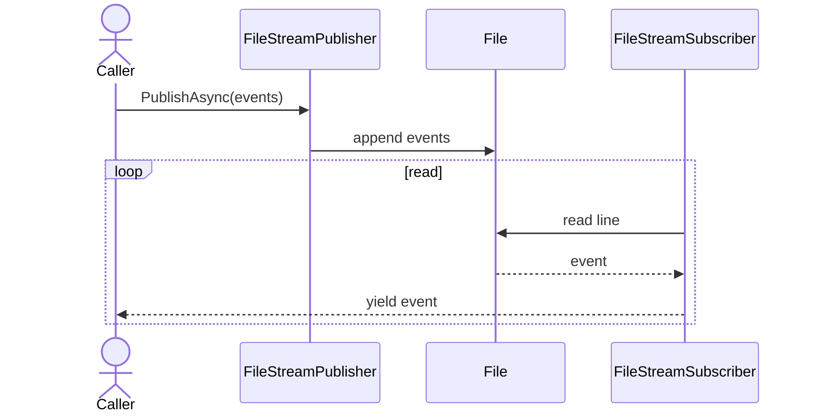

# Ark.Alliance.Core.Mediator.Messaging.Streaming

## Table of Contents
- [Summary](#summary)
- [Main Features](#main-features)
- [Use Cases](#use-cases)
- [Project Structure](#project-structure)
- [Functional Diagram](#functional-diagram)
- [Class Diagram](#class-diagram)
- [UML Sequence Diagram](#uml-sequence-diagram)
- [Code Examples](#code-examples)
- [Table of Components](#table-of-components)
- [Dependencies](#dependencies)
- [Licenses and Acknowledgments](#licenses-and-acknowledgments)
- [Release](#release)
- [Author and Reference Date](#author-and-reference-date)

## Summary
Ark.Alliance.Core.Mediator.Messaging.Streaming offers light-weight streaming utilities built on **.NET 9**. It bridges the Ark CQRS dispatcher with brokers, channels and simple file storage so messages can be exchanged asynchronously. Unlike monolithic queues tightly coupled to service logic, these publishers and subscribers keep the application layers independent and are easy to swap for testing or durability.

The library evolves from the minimal in-memory channels found in early prototypes to persistent file-based streams and broker adapters. This progression allows services to start small and grow toward distributed messaging without rewriting handlers. Integration relies on the existing Ark dispatcher pipeline, so commands and events reuse the same middleware and logging infrastructure.

## Main Features
- **In-memory streaming** using `Channel<T>` for unit tests or single-process tools.
- **File-backed persistence** through `FileStreamPublisher<T>` and `FileStreamSubscriber<T>` for simple durability.
- **Broker bridging** via `BrokerStreamPublisher<T>` and `BrokerStreamSubscriber<T>` to connect with external message buses.
- **Asynchronous acknowledgements** so callers can react to each published item.

## Use Cases
- Quickly simulate event flows during integration testing without a real broker.
- Persist events to disk when a full message bus is unnecessary.
- Forward dispatcher events to existing brokers so other microservices can react.
- Replay historical events from files into a new service instance.

## Project Structure
The project follows Clean Architecture principles with a focus on messaging abstractions:

- **Publishers** and **subscribers** implement `IStreamPublisher<T>` and `IStreamSubscriber<T>`.
- **Adapters** bridge channels, file storage or brokers.
- The [SUMMARY.md](SUMMARY.md) file provides a concise API reference.

### Compliance
- **DDD:** messaging components keep domain code isolated from infrastructure.
- **Event-Driven:** events flow asynchronously through publishers and subscribers.
- **Clean Architecture:** abstractions allow swapping transports without touching application logic.

## Functional Diagram


## Class Diagram


## UML Sequence Diagram


## Code Examples
- **In-memory pipeline**
  ```csharp
  var channel = Channel.CreateUnbounded<MyEvent>();
  var publisher = new InMemoryStreamPublisher<MyEvent>(channel);
  var subscriber = new InMemoryStreamSubscriber<MyEvent>(channel);
  await publisher.PublishAsync(GetEvents(), ct);
  await foreach (var e in subscriber.ConsumeAsync(string.Empty, ct)) { }
  ```
- **File persistence**
  ```csharp
  var pub = new FileStreamPublisher<MyEvent>("/tmp/streams", "orders");
  await pub.PublishAsync(GetEvents(), ct);
  ```
- **Broker forwarding**
  ```csharp
  var brokerPub = new BrokerStreamPublisher<MyEvent>(producer, "orders");
  await brokerPub.PublishAsync(GetEvents(), ct);
  ```
- **Acknowledgement handling**
  ```csharp
  await foreach (var ack in publisher.PublishAsync(events, ct))
      Console.WriteLine(ack.Status);
  ```

## Table of Components
| Component | Description | Docs |
|-----------|-------------|------|
| `InMemoryStreamPublisher<T>` | Writes items to a `Channel<T>` | [SUMMARY](SUMMARY.md) |
| `InMemoryStreamSubscriber<T>` | Reads items from a `Channel<T>` | [SUMMARY](SUMMARY.md) |
| `FileStreamPublisher<T>` | Appends JSON lines to a file | [SUMMARY](SUMMARY.md) |
| `FileStreamSubscriber<T>` | Streams events from a file | [SUMMARY](SUMMARY.md) |
| `BrokerStreamPublisher<T>` | Publishes to a broker topic | [SUMMARY](SUMMARY.md) |
| `BrokerStreamSubscriber<T>` | Consumes from a broker topic | [SUMMARY](SUMMARY.md) |

## Dependencies
- .NET 9 SDK
- `Ark.Alliance.Core.Mediator.Messaging` (project reference)
- `Ark.Alliance.Core.Mediator.Messaging.Abstractions` (project reference)

## Licenses and Acknowledgments
This project is released under the [MIT License](../../LICENSE.txt). This README was partially generated with assistance from Codex by OpenAI, version 1.0, and manually reviewed for accuracy.

## Release
- v0.1: In-memory streaming utilities - July 2025
- v0.2: File persistence providers - July 2025
- v0.3: Broker adapters - July 2025

## Author and Reference Date
Author: Armand Richelet-Kleinberg  
Reference Date: July 22, 2025
