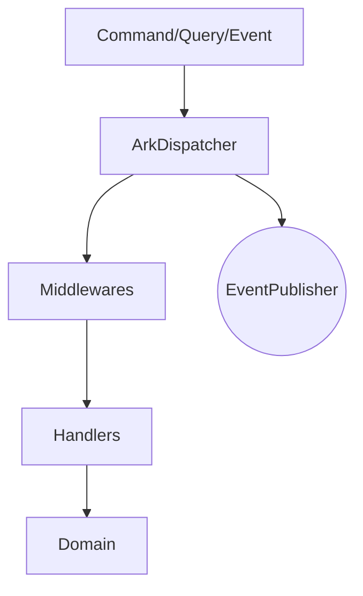
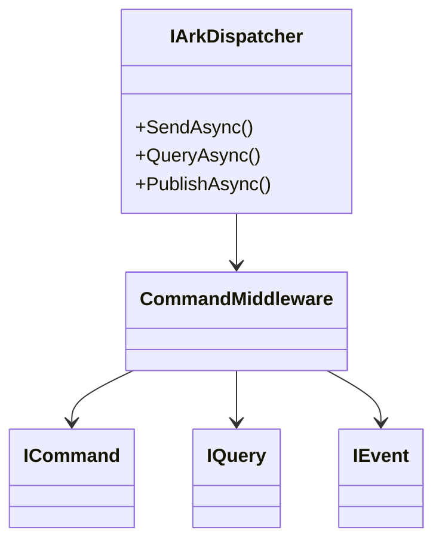
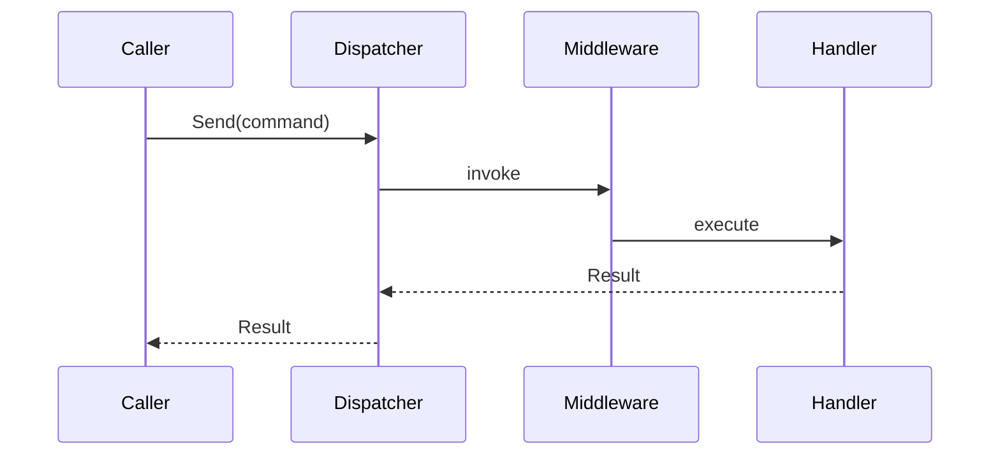

# Ark.Alliance.Core.Mediator.Messaging

## Table of Contents
- [Summary](#summary)
- [Main Features](#main-features)
- [Use Cases](#use-cases)
- [Project Structure](#project-structure)
- [Functional Diagram](#functional-diagram)
- [Class Diagram](#class-diagram)
- [UML Sequence Diagram](#uml-sequence-diagram)
- [Code Examples](#code-examples)
- [Table of Components](#table-of-components)
- [Dependencies](#dependencies)
- [Licenses and Acknowledgments](#licenses-and-acknowledgments)
- [Release](#release)
- [Author and Reference Date](#author-and-reference-date)

## Summary
This library implements a lightweight CQRS dispatcher with a middleware pipeline. It replaces MediatR to reduce dependencies and offers extensibility for commands, queries and events. Event publishers can be plugged in for brokers such as RabbitMQ or ZeroMQ, while the core remains framework agnostic and targets .NET 9.

## Main Features
- Minimal `IArkDispatcher` interface for commands, queries and events.
- Middleware pipeline supporting pre/post processors and exception handling.
- Result handling optimized for async scenarios.
- Extensible event publishers for various broker technologies.

## Use Cases
- Dispatch commands in microservices without referencing external libraries.
- Inject validation, logging or retry behaviors via middleware.
- Publish events to multiple brokers through configurable adapters.

## Project Structure
```
Ark.Alliance.Core.Mediator.Messaging/
|-- Contracts/                 # Interfaces for commands, queries and events
|-- DependencyInjection/       # DI helpers and middleware registration
|-- Dispatching/               # Dispatcher implementation
|-- Eventing/                  # Event publishers
|-- Handlers/                  # Handler abstractions
|-- Middleware/                # Built-in middlewares
|-- ArkMessagingOptions.cs
|-- README.md
|-- Ark.Alliance.Core.Mediator.Messaging.csproj
```
### Compliance
- **DDD** – separates application handlers from infrastructure concerns.
- **Event‑Driven** – publishes events via pluggable brokers.
- **Clean Architecture** – dispatcher and contracts keep layers independent.

## Functional Diagram


## Class Diagram


## UML Sequence Diagram


## Code Examples
```csharp
// Use generated handler registrations only
var opts = new ArkMessagingOptions { HandlerRegistration = HandlerRegistrationMode.Generated };
services.AddArkMessaging(opts, typeof(Program).Assembly);
services.AddRetryCommandMiddleware(o => o.RetryCount = 3);
```

## Table of Components
| Component | Description | Docs |
|-----------|-------------|------|
| `ArkDispatcher` | Core dispatcher for commands, queries and events | [Source](Dispatching/ArkDispatcher.cs) |
| `LoggingCommandMiddleware` | Logs command processing | [Middleware](Middleware/Logging/LoggingCommandMiddleware.cs) |
| `RetryCommandMiddleware` | Retries failed commands using Polly | [Middleware](Middleware/Resilience/RetryCommandMiddleware.cs) |
| `PollyCommandMiddleware` | Applies a Polly policy for commands | [Middleware](Middleware/Resilience/PollyCommandMiddleware.cs) |
| `PipelineCommandMiddleware` | Uses Microsoft resilience pipeline | [Middleware](Middleware/Resilience/PipelineCommandMiddleware.cs) |

## Dependencies
- Polly 7.2.3
- Microsoft.Extensions.Resilience 9.6.0
- Ark.Alliance.Core (project reference)
- Ark.Alliance.Core.Mediator.Generators (project reference)

## Licenses and Acknowledgments
- MIT License for this library
- Polly under MIT: https://github.com/App-vNext/Polly
- Microsoft.Extensions libraries under MIT: https://github.com/dotnet/runtime
- This README was partially generated with assistance from Grok by xAI and manually reviewed for accuracy.

## Release
- v1.0: Initial dispatcher and middleware pipeline - July 2025

## Author and Reference Date
*Author: Armand Richelet-Kleinberg*

*Reference Date: July 22, 2025*
