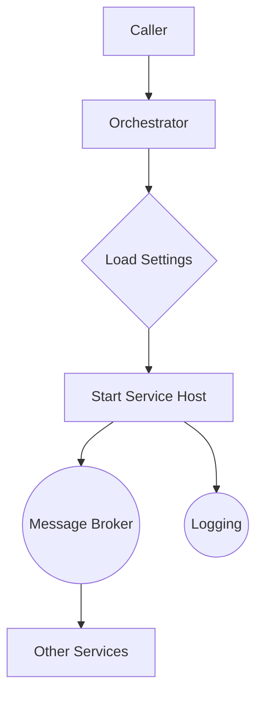
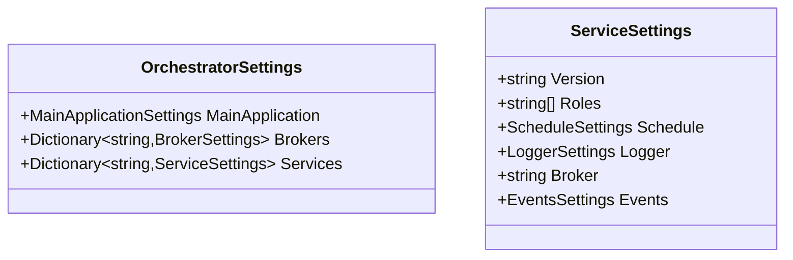
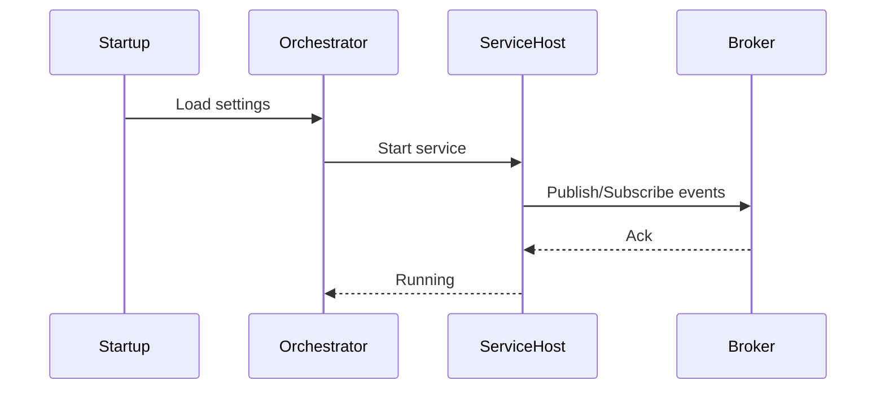

# Ark.Alliance.Core.Mediator.Services.Orchestrator

## Table of Contents
- [Summary](#summary)
- [Main Features](#main-features)
- [Use Cases](#use-cases)
- [Project Structure](#project-structure)
- [Functional Diagram](#functional-diagram)
- [Class Diagram](#class-diagram)
- [Configuration Schema](#configuration-schema)
- [UML Sequence Diagram](#uml-sequence-diagram)
- [Code Examples](#code-examples)
- [Container Usage](#container-usage)
- [Table of Microservices and Components](#table-of-microservices-and-components)
- [Dependencies](#dependencies)
- [Licenses and Acknowledgments](#licenses-and-acknowledgments)
- [Release](#release)
- [Author and Reference Date](#author-and-reference-date)

## Summary
Ark.Alliance.Core.Mediator.Services.Orchestrator is a lightweight host designed to launch and configure multiple microservices from a single entry point. Built on **.NET 9**, it relies on configuration files to describe brokers, services and schedules, keeping orchestration declarative. By centralizing service startup and messaging setup it helps decouple infrastructure concerns from individual services. The orchestrator evolves the traditional monolithic startup logic into an event-driven approach where services publish and subscribe through brokers for resilience and scalability. Optional concurrency and health-check settings allow adaptation to various environments.

## Main Features
- **Core Operations**
  - Load service and broker definitions from `appsettings.json`.
  - Start each service host with its associated schedule and roles.
  - Map configuration sections to strongly typed models for validation.
- **Extended Features**
  - Toggle logging middleware via the `Ark:Messaging` configuration.
  - Limit concurrency with `MaxDegreeOfParallelism` and optional startup delays.
  - Fail fast with `StopOnError` or continue on failures.
  - Enable health endpoints via `EnableHealthChecks`.
- **Service-Specific**
  - Supports individual event publishing and subscription rules per service.
  - Example configuration for a `Catalog` microservice.

## Use Cases
- Deploy multiple services with consistent messaging rules.
- Manage start order for background tasks or APIs.
- Centralize broker information for RabbitMQ or ZeroMQ integrations.
- Disable or enable logging across all services through a single setting.

## Project Structure
```
Ark.Alliance.Core.Mediator.Services.Orchestrator/
|-- Domain/                # Configuration models
|   `-- Configuration/
|       `-- OrchestratorSettings.cs
|-- Service/               # Default configuration files
|   `-- appsettings.json
|-- README.md
|-- SUMMARY.md
```
### Compliance
- **DDD**: Configuration models isolated in the `Domain` folder.
- **Event-Driven**: Services communicate via configured brokers.
- **Clean Arch**: Orchestrator logic separated from infrastructure concerns.

## Functional Diagram


## Class Diagram


## Configuration Schema
The configuration file is divided into four main sections. Each maps to a
strongly typed model described in [SUMMARY.md](SUMMARY.md).

| Section | Description |
|---------|-------------|
| `MainApplication` | Database connections and authorization settings. |
| `Brokers` | Named message broker endpoints. |
| `Ark:Messaging` | Global messaging options such as logging. |
| `Services` | Individual service definitions and schedules. |
| `MaxDegreeOfParallelism` | Max number of services started concurrently. |
| `EnableHealthChecks` | Enable health endpoints for services. |
| `StopOnError` | Halt startup if a service fails. |
| `Priority` | Service start order (per service). |
| `StartupTimeoutSeconds` | Per-service startup time limit. |
| `InstanceCount` | Number of parallel instances for a service. |
| `RetryCount` | Number of startup retries when a service fails. |

A sample file is available under `Service/appsettings.json`.

## UML Sequence Diagram


## Code Examples
- **Building the orchestrator**
  ```csharp
  var settings = configuration.GetSection("Orchestrator").Get<OrchestratorSettings>();
  services.AddSingleton(settings);
  ```
- **Toggling logging**
  ```json
  "Ark": {
    "Messaging": { "EnableLogging": false }
  },
  "MaxDegreeOfParallelism": 4,
  "EnableHealthChecks": true,
  "StopOnError": false
  ```
- **Service schedule snippet**
  ```json
  "Catalog": {
    "Schedule": { "ScheduledLaps": "0.00:05:00" },
    "Enabled": true,
    "StartupDelaySeconds": 30,
    "StartupTimeoutSeconds": 10,
    "Priority": 1,
    "InstanceCount": 2,
    "RetryCount": 3
  }
  ```
- **Starting services**
  ```csharp
  foreach (var svc in settings.Services) {
      StartHost(svc.Value);
  }
  ```

## Container Usage
Build and run the orchestrator service using Docker:
```bash
docker build -t ark-orchestrator -f Ark.Alliance.Core.Mediator.Services.Orchestrator/Dockerfile .
docker run --rm -v $(pwd)/orchestrator-config:/app/config ark-orchestrator
```
Mount a folder containing `appsettings.json` under `/app/config` to override the default configuration.

## Table of Microservices and Components
| Microservice | Description | Key Features | Docs Link |
|--------------|-------------|--------------|----------|
| Catalog | Sample product catalog service | Publishes `ProductCreated`, subscribes `UserRegistered` | [Summary](SUMMARY.md) |

## Dependencies
- .NET 9 SDK
- Microsoft.Extensions.Configuration 9.0.6

## Licenses and Acknowledgments
- [MIT License](../../LICENSE.txt)
- This README was partially generated with assistance from OpenAI Codex and manually reviewed for accuracy.

## Release
- v1.0: Initial orchestrator skeleton - July 22, 2025

## Author and Reference Date
Author: Armand Richelet-Kleinberg  
Reference Date: July 23, 2025
