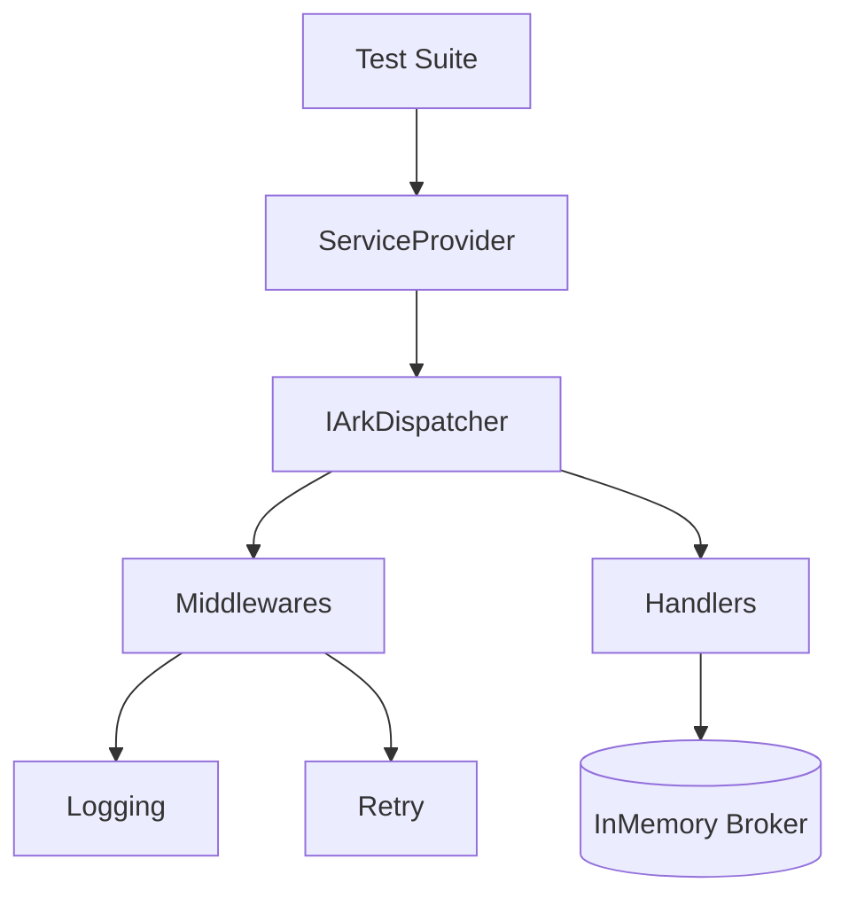
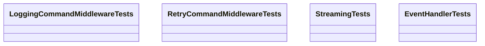
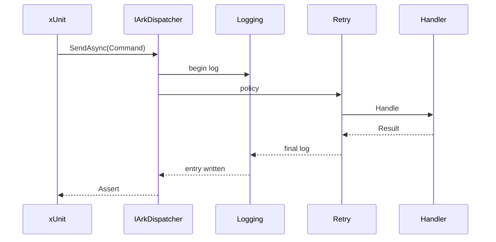

# Ark.Alliance.Core.Mediator.Tests

## Table of Contents
- [Summary](#summary)
- [Main Features](#main-features)
- [Use Cases](#use-cases)
- [Project Structure](#project-structure)
- [Functional Diagram](#functional-diagram)
- [Class Diagram](#class-diagram)
- [UML Sequence Diagram](#uml-sequence-diagram)
- [Code Examples](#code-examples)
- [Notable Test Cases](#notable-test-cases)
- [Table of Components](#table-of-components)
- [Dependencies](#dependencies)
- [Licenses and Acknowledgments](#licenses-and-acknowledgments)
- [Release](#release)
- [Author and Reference Date](#author-and-reference-date)
- [SDLC](#sdlc)

## Summary
`Ark.Alliance.Core.Mediator.Tests` contains the xUnit suite validating the dispatcher, middleware pipeline and streaming components. Unlike reflection based frameworks such as **MediatR**, the dispatcher relies on compile‑time source generation. The tests confirm these generated mappings work correctly and that commands, events and retries behave predictably.
Integration tests that require external services use **Testcontainers** to spin up ephemeral instances. See [`testcontainers_dotnet_9.Md`](../../_SDLC/04_Testing/testcontainers_dotnet_9.Md) for setup instructions.

## Main Features
- **Core Operations**
  - Unit tests for commands, events and streaming handlers.
  - Verification of middleware such as logging, retry and AI decisions.
- **Extended Features**
  - Dynamic dispatch, generic handler registration and error handling scenarios.
  - AI decision middleware coverage and configuration tests for logging options.
  - Pre- and post-processor execution ensuring command data can be modified.
  - Orchestrator host tests validate service startup, priority and failure modes.
  - Resilience middleware checks guarantee retry and timeout behaviour.
  - Reflection cache and registration mode tests ensure deterministic handler lookup.
- **Service-Specific**
  - Targets the Ark Alliance messaging libraries to maintain robust behavior.

## Use Cases
- Provide regression coverage when updating the dispatcher or middleware.
- Demonstrate expected behaviour for custom handlers.
- Validate integration with IoC helpers.
- Verify AI decision outcomes when commands are denied or approved.

## Project Structure
```
Ark.Alliance.Core.Mediator.Tests/
|-- LoggingCommandMiddlewareTests.cs
|-- RetryCommandMiddlewareTests.cs
|-- StreamingTests.cs
|-- EventHandlerTests.cs
|-- EventPublisherTests.cs
|-- DispatcherErrorTests.cs
|-- StreamingLoggingSampleTests.cs
|-- RetryConfigurationTests.cs
|-- RegistrationModeTests.cs
|-- PrePostProcessorTests.cs
|-- PollyConfigurationTests.cs
|-- PipelineConfigurationTests.cs
|-- PingCommandHandlerTests.cs
|-- OrchestratorHostTests.cs
|-- Ark.Alliance.Core.Mediator.Tests.csproj
```
### Compliance
For more background documentation see the [_Sdlc](./_Sdlc/README.md) folder.
- **DDD** – tests exercise domain behaviour through public contracts only.
- **Event-Driven** – verifies event publishing and subscription.
- **Clean Arch** – no direct coupling to infrastructure implementations.
- **Generator Cache** – verifies asynchronous caching behaviour.

## Functional Diagram


## Class Diagram


## UML Sequence Diagram


## Code Examples
- **Run all tests**
  ```bash
  dotnet test
  ```
  *Use case: execute during CI to ensure regressions are caught.*
- **Filter by trait**
  ```bash
  dotnet test --filter Category=Streaming
  ```
  *Use case: run only streaming tests during development.*
- **Run a specific test class**
  ```bash
  dotnet test --filter FullyQualifiedName~PrePostProcessorTests
  ```
  *Use case: focus on processor behaviour when debugging.*

## Notable Test Cases
- **StreamingLoggingSampleTests** demonstrates console logging and stream cancellation. It configures services with `AddCqrsLogging` and `AddRetryCommandMiddleware` before dispatching `PingCommand` and enumerating a `NumberStreamRequest`.
  ```csharp
  var services = new ServiceCollection();
  services.AddLogging();
  services.AddArkMessaging(typeof(PingCommand).Assembly);
  services.AddCqrsLogging();
  services.AddRetryCommandMiddleware();
  var dispatcher = services.BuildServiceProvider().GetRequiredService<IArkDispatcher>();
  await dispatcher.SendAsync<PingCommand, string>(new PingCommand());
  ```
- **RetryConfigurationTests** reads `Ark:Messaging:EnableRetry` from configuration. When enabled the retry middleware is registered and `RetryOptions` reflect the configured count.
- **RegistrationModeTests** verifies handler discovery using reflection versus generated registrations by setting `ArkMessagingOptions.HandlerRegistration`.
- **PrePostProcessorTests** ensures custom processors run before and after the command handler to mutate the request and response objects.
- **PollyConfigurationTests** toggles `EnablePolly` to check Polly based resilience policies and demonstrates a transient failure being retried.
- **PipelineConfigurationTests** validates registration of Microsoft.Extensions.Resilience pipeline policies when enabled.
- **PingCommandHandlerTests** exercises the sample `PingCommandHandler` returning `Pong`.
- **OrchestratorHostTests** covers service host behaviour such as parallelism, startup delays, priority ordering, stopping on errors, timeouts, retry logic and running multiple instances.

## Table of Components
| Component | Description | Docs Link |
|-----------|-------------|----------|
| `LoggingCommandMiddlewareTests` | Tests logging middleware output | N/A |
| `RetryCommandMiddlewareTests` | Ensures retry policy resends commands | N/A |
| `StreamingTests` | Verifies `CreateStream` returns expected items | N/A |
| `EventHandlerTests` | Confirms event handler base class logic | N/A |
| `StreamingLoggingSampleTests` | Samples logging and cancellation during streaming | N/A |
| `RetryConfigurationTests` | Configuration-driven retry registration | N/A |
| `RegistrationModeTests` | Handler resolution with reflection or generated code | N/A |
| `PrePostProcessorTests` | Command pre/post processing behaviour | N/A |
| `PollyConfigurationTests` | Polly middleware configuration and retries | N/A |
| `PipelineConfigurationTests` | Microsoft.Resilience pipeline middleware | N/A |
| `PingCommandHandlerTests` | Verifies the simple ping handler returns pong | N/A |
| `OrchestratorHostTests` | Validates service host startup behaviour | N/A |

## Dependencies
- Microsoft.NET.Test.Sdk 17.14.1
- xunit 2.9.3
- xunit.runner.visualstudio 3.1.3
- Testcontainers 4.6.0 (RabbitMQ integration tests)

## Licenses and Acknowledgments
This project is released under the [MIT License](../../LICENSE.txt). xUnit packages are also MIT licensed. This README was partially generated with assistance from Codex by OpenAI and manually reviewed for accuracy.
Integration tests rely on the MIT licensed [Testcontainers for .NET](https://github.com/testcontainers/testcontainers-dotnet) library.
For debugging container issues see [`testcontainers_troubleshooting_procedure.md`](../../_SDLC/04_Testing/testcontainers_troubleshooting_procedure.md).

## Release
- 2025-07-23 Initial test documentation.
- 2025-07-24 Added dynamic dispatch and AI decision coverage.

## Author and Reference Date
- Author: Armand Richelet-Kleinberg
- Reference Date: July 23, 2025

## SDLC
Detailed analysis, design, implementation notes and the test plan are stored in the solution's [`_SDLC`](../../_SDLC/Ark.Alliance.Core.Mediator.Tests.md) section. Refer to the [solution SDLC overview](../../_SDLC/README.md) for the broader context.
