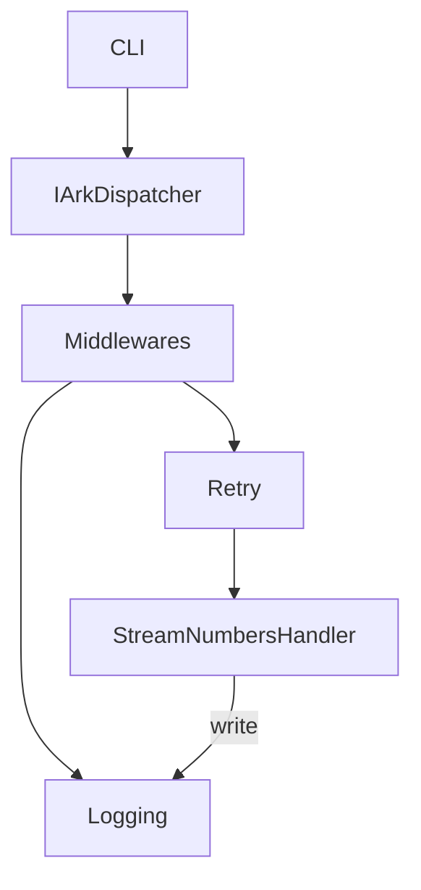
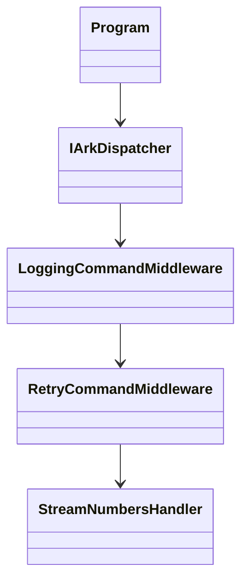
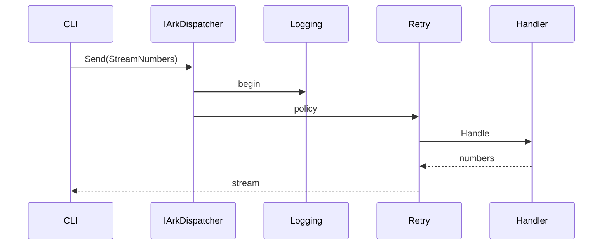

# StreamingLoggingSample

## Table of Contents
- [Summary](#summary)
- [Main Features](#main-features)
- [Use Cases](#use-cases)
- [Project Structure](#project-structure)
- [Functional Diagram](#functional-diagram)
- [Class Diagram](#class-diagram)
- [UML Sequence Diagram](#uml-sequence-diagram)
- [Code Examples](#code-examples)
- [Table of Components](#table-of-components)
- [Dependencies](#dependencies)
- [Licenses and Acknowledgments](#licenses-and-acknowledgments)
- [Release](#release)
- [Author and Reference Date](#author-and-reference-date)

## Summary
`StreamingLoggingSample` is a console application that showcases streaming responses using **Ark.Alliance.Core.Mediator** with console logging and retry middleware enabled. Unlike traditional monolithic tools that require heavy frameworks, this minimal sample runs in a container and relies on compile-time dispatcher registration. A command produces an asynchronous stream of numbers while middleware records each step and retries on transient failures.

## Main Features
- **Core Operations**
  - Dispatch a command that yields an `IAsyncEnumerable<int>`.
  - Log command execution to the console.
  - Retry middleware demonstrates resilience policies.
  - `PingCommand` showcases simple request/response handling and prints `Pong` to the console.

- **Extended Features**
- Containerized execution via the provided Dockerfile.
- Demonstrates cancellation with `CancellationTokenSource`.
- Uses `AddHybridHandlers` to combine compile-time and runtime handler discovery.

## Use Cases
- Quick reference for developers integrating streaming handlers.
- Demonstrates minimal mediator configuration.
- Run in a container to test deployment without a full toolchain.

## Project Structure
```
StreamingLoggingSample/
|-- Program.cs
|-- Dockerfile
|-- StreamingLoggingSample.csproj
```
See additional SDLC notes under [`_Sdlc`](./_Sdlc/README.md).

## Functional Diagram


## Class Diagram


## UML Sequence Diagram


## Code Examples
```csharp
await foreach (var n in dispatcher.CreateStream(new StreamNumbers(5)))
    Console.WriteLine(n);
```
```bash
# Build and run the container
docker build -t streaming-sample .
docker run --rm streaming-sample
```

## Table of Components
| Component | Description | Docs Link |
|-----------|-------------|----------|
| `Program` | Configures services and dispatches the sample commands | N/A |
| `StreamNumbersHandler` | Returns a stream of integers with logging | N/A |

## Dependencies
- Microsoft.Extensions.Hosting 9.0.0
- Ark.Alliance.Core.Mediator (project reference)

## Licenses and Acknowledgments
This sample is released under the [MIT License](../../../LICENSE.txt). This README was partially generated with assistance from Codex by OpenAI and manually reviewed for accuracy.

## Release
- 2025-07-23 Initial example demonstrating streaming and logging.

## Author and Reference Date
- Author: Armand Richelet-Kleinberg
- Reference Date: July 23, 2025

## SDLC
See [`_Sdlc`](./_Sdlc/README.md) for detailed analysis, design, implementation notes and test plans. The folder includes a [Copier guide](./_Sdlc/Copier.md) for reusing this example. The [solution SDLC](../../../_SDLC/README.md) provides overall guidance.
