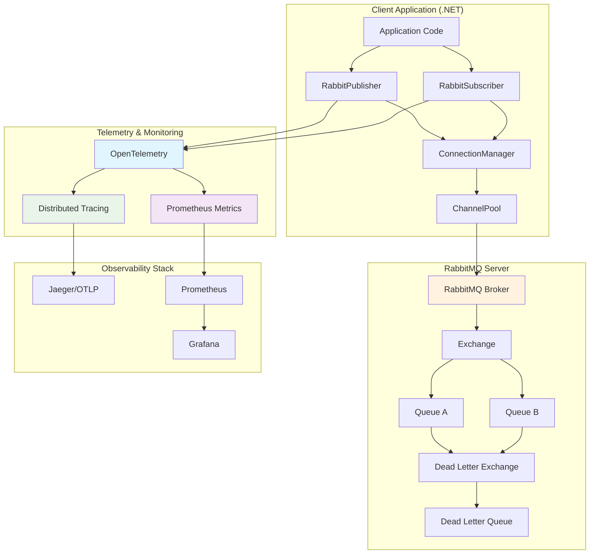

# Complete Guide: RabbitMQ.Client 7.1.2 (.NET) - Event-Driven Architecture

## Introduction

RabbitMQ.Client 7.1.2 is the official .NET library for RabbitMQ, compatible with .NET Standard 2.0+ and .NET 4.6.1+. This major version introduces a **fully asynchronous API** and significant improvements in performance and observability. This comprehensive guide targets C#/.NET developers who want to implement a robust and modern RabbitMQ solution.

## Major Changes in Version 7.x

### 🚨 Breaking Changes

- **Fully Asynchronous API**: All calls now use await/async with CancellationToken
- **IChannel replaces IModel**: New interface for channel operations
- **ReadOnlyMemory<byte>**: Payloads now use System.ReadOnlyMemory<byte> instead of byte arrays
- **BasicProperties**: Replacement of IBasicProperties with BasicProperties

### ✨ New Features

- **Built-in OpenTelemetry Support**: RabbitMQ.Client.OpenTelemetry package
- **Enhanced OAuth2**: RabbitMQ.Client.OAuth2 2.0+ package
- **Optimized Performance**: Significant memory allocation reductions and improved throughput
- **System.Threading.Channels**: Using channels for better performance

## Architecture Diagram with Embedded Telemetry



## 1. Core RabbitMQ Features

### 1.1 Exchanges & Routing
- **Direct** — routes by exact routing-key match
- **Fanout** — broadcasts to all bound queues
- **Topic** — pattern-based routing (*, #)
- **Headers** — routes via message headers
- **Alternate Exchange** — fallback exchange for unrouted messages

### 1.2 Queues
- **Durable vs Non-durable** — survives broker restarts only if declared durable with persistent messages
- **Exclusive** — visible only to declaring connection; auto-deleted on disconnect
- **Auto-delete** — queue removed when last consumer disconnects
- **TTL & Expiry** — per-message or per-queue TTL; x-expires for queue lifetime
- **Quorum Queues** — Raft-backed replication (RabbitMQ ≥ 3.8). Preferred over classic mirrors for HA
- **Lazy Queues** — messages spooled to disk to spare RAM; default behavior since 3.12

### 1.3 Messages & Properties
ContentType, ContentEncoding, DeliveryMode (2 = persistent), Priority, Message TTL, CorrelationId, ReplyTo, custom headers, etc.

### 1.4 Core AMQP Commands
ExchangeDeclareAsync, QueueDeclareAsync/BindAsync, BasicPublishAsync, BasicConsumeAsync, BasicGetAsync, BasicAckAsync/NackAsync/RejectAsync, BasicQosAsync, ConfirmSelectAsync

### 1.5 Consumption Modes
- **Push (BasicConsumeAsync)** — preferred for throughput
- **Pull (BasicGetAsync)** — synchronous, high overhead; reserve for diagnostics

### 1.6 Connections & Channels
- One TCP connection per process (ideally), reused for lifetime
- Multiple lightweight channels per connection (not thread-safe; one channel per thread)
- Separate connections for publishing vs consuming to avoid TCP back-pressure

## 2. Best Practices & Limitations

| Area | Common Pitfall | Recommended Fix |
|------|---------------|-----------------|
| Connections | Opening/closing per message | Keep long-lived connection; reuse channels |
| Channels | Shared across threads | One channel per thread/task |
| Consumption | Polling with BasicGetAsync | Use BasicConsumeAsync + BasicQosAsync (prefetch) |
| Prefetch | Not set (∞) → RAM blow-up | Tune prefetch (e.g., 10-50) |
| Queue Size | Millions of pending messages | Keep queues short; use TTL, x-max-length, Lazy queues |
| HA | Classic mirrors split-brain | Use Quorum Queues |
| Cross-DC Cluster | WAN partitions | Use Federation/Shovel instead |
| Priorities | Too many priority levels | Limit to ≤ 5 or avoid |
| Large Messages | Multi-MB payloads | Send pointer (URL) not blob |
| Security | guest/guest exposed | Create dedicated users, enforce TLS |

## 3. Modern C# Library Architecture

### 3.1 Core Components

```csharp
// Connection manager with auto-recovery
public interface IConnectionManager : IAsyncDisposable
{
    Task<IConnection> GetConnectionAsync(CancellationToken ct = default);
    bool IsConnected { get; }
}

// Thread-safe channel pool
public interface IChannelPool : IAsyncDisposable
{
    Task<IChannel> RentChannelAsync(CancellationToken ct = default);
    Task ReturnChannelAsync(IChannel channel, CancellationToken ct = default);
}

// Publisher with confirms and retry
public interface IRabbitPublisher
{
    Task PublishAsync<T>(T message, string exchange, string routingKey, 
        BasicProperties? properties = null, CancellationToken ct = default);
    Task PublishBatchAsync<T>(IEnumerable<T> messages, string exchange, 
        CancellationToken ct = default);
}

// Subscriber with back-pressure
public interface IRabbitSubscriber
{
    Task SubscribeAsync<T>(string queueName, 
        Func<MessageContext<T>, CancellationToken, Task> handler,
        CancellationToken ct = default);
}

// Message context with metadata
public class MessageContext<T>
{
    public T Body { get; }
    public BasicProperties Properties { get; }
    public string Exchange { get; }
    public string RoutingKey { get; }
    public ulong DeliveryTag { get; }
    public IChannel Channel { get; }
    
    public Task AckAsync() => Channel.BasicAckAsync(DeliveryTag, false);
    public Task NackAsync(bool requeue = true) => 
        Channel.BasicNackAsync(DeliveryTag, false, requeue);
}
```

### 3.2 Modern Configuration

```csharp
public class RabbitOptions
{
    public List<string> Hosts { get; set; } = new();
    public string VirtualHost { get; set; } = "/";
    public string UserName { get; set; } = "guest";
    public string Password { get; set; } = "";
    public bool UseTls { get; set; } = true;
    public bool PublisherConfirms { get; set; } = true;
    public ushort Prefetch { get; set; } = 20;
    public TimeSpan Heartbeat { get; set; } = TimeSpan.FromSeconds(60);
    
    // New v7.x options
    public TimeSpan NetworkRecoveryInterval { get; set; } = TimeSpan.FromSeconds(5);
    public int ChannelPoolSize { get; set; } = 10;
    public bool EnableOpenTelemetry { get; set; } = true;
    
    public RetryOptions Retry { get; set; } = new();
    public OAuth2Options? OAuth2 { get; set; }
}

public class RetryOptions
{
    public int MaxAttempts { get; set; } = 3;
    public TimeSpan BaseDelay { get; set; } = TimeSpan.FromSeconds(1);
    public bool ExponentialBackoff { get; set; } = true;
    public double BackoffMultiplier { get; set; } = 2.0;
}
```

### 3.3 Publisher Implementation Example

```csharp
public class RabbitPublisher : IRabbitPublisher
{
    private readonly IChannelPool _channelPool;
    private readonly ILogger<RabbitPublisher> _logger;
    private readonly RabbitOptions _options;
    private readonly ResiliencePipeline _resiliencePipeline;

    public async Task PublishAsync<T>(T message, string exchange, string routingKey,
        BasicProperties? properties = null, CancellationToken ct = default)
    {
        await _resiliencePipeline.ExecuteAsync(async (ctx) =>
        {
            var channel = await _channelPool.RentChannelAsync(ct);
            try
            {
                var body = JsonSerializer.SerializeToUtf8Bytes(message);
                var readOnlyMemory = new ReadOnlyMemory<byte>(body);
                
                properties ??= new BasicProperties
                {
                    Persistent = true,
                    ContentType = "application/json",
                    MessageId = Guid.NewGuid().ToString(),
                    Timestamp = new AmqpTimestamp(DateTimeOffset.UtcNow.ToUnixTimeSeconds())
                };

                // Native async API v7.x
                await channel.BasicPublishAsync(
                    exchange: exchange,
                    routingKey: routingKey,
                    mandatory: false,
                    basicProperties: properties,
                    body: readOnlyMemory,
                    cancellationToken: ct);

                if (_options.PublisherConfirms)
                {
                    await channel.WaitForConfirmsOrDieAsync(ct);
                }
            }
            finally
            {
                await _channelPool.ReturnChannelAsync(channel, ct);
            }
        }, ct);
    }
}
```

### 3.4 Subscriber Implementation Example

```csharp
public class RabbitSubscriber : IRabbitSubscriber
{
    public async Task SubscribeAsync<T>(string queueName,
        Func<MessageContext<T>, CancellationToken, Task> handler,
        CancellationToken ct = default)
    {
        var channel = await _channelPool.RentChannelAsync(ct);
        
        // QoS configuration
        await channel.BasicQosAsync(prefetchCount: _options.Prefetch, 
            prefetchSize: 0, global: false, ct);

        var consumer = new AsyncEventingBasicConsumer(channel);
        
        consumer.ReceivedAsync += async (sender, args) =>
        {
            try
            {
                var message = JsonSerializer.Deserialize<T>(args.Body.Span);
                var context = new MessageContext<T>
                {
                    Body = message,
                    Properties = args.BasicProperties,
                    Exchange = args.Exchange,
                    RoutingKey = args.RoutingKey,
                    DeliveryTag = args.DeliveryTag,
                    Channel = channel
                };

                await handler(context, ct);
            }
            catch (Exception ex)
            {
                _logger.LogError(ex, "Error processing message");
                await channel.BasicNackAsync(args.DeliveryTag, false, true, ct);
            }
        };

        await channel.BasicConsumeAsync(
            queue: queueName,
            autoAck: false,
            consumer: consumer,
            cancellationToken: ct);
    }
}
```

## 4. Observability & Monitoring

### 4.1 Built-in OpenTelemetry

```csharp
// Program.cs
builder.Services.AddOpenTelemetry()
    .WithTracing(tracing =>
    {
        tracing.AddRabbitMQInstrumentation(); // RabbitMQ.Client.OpenTelemetry package
        tracing.AddOtlpExporter();
    })
    .WithMetrics(metrics =>
    {
        metrics.AddRabbitMQInstrumentation();
        metrics.AddPrometheusExporter();
    });
```

### 4.2 Custom Metrics

```csharp
public class RabbitMetrics
{
    private readonly Counter<long> _messagesPublished;
    private readonly Counter<long> _messagesConsumed;
    private readonly Histogram<double> _publishLatency;
    private readonly Histogram<double> _processLatency;

    public RabbitMetrics(IMeterFactory meterFactory)
    {
        var meter = meterFactory.Create("RabbitMQ.Client.Custom");
        
        _messagesPublished = meter.CreateCounter<long>(
            "rabbitmq_messages_published_total",
            description: "Total messages published");
            
        _messagesConsumed = meter.CreateCounter<long>(
            "rabbitmq_messages_consumed_total", 
            description: "Total messages consumed");
            
        _publishLatency = meter.CreateHistogram<double>(
            "rabbitmq_publish_duration_seconds",
            description: "Message publish latency");
            
        _processLatency = meter.CreateHistogram<double>(
            "rabbitmq_process_duration_seconds",
            description: "Message processing latency");
    }
}
```

## 5. RabbitMQ Server Installation Guide

### 5.1 Docker Installation (Recommended for Development)

#### Quick Start with Docker
```bash
# Latest RabbitMQ 4.x with management UI
docker run -d --name rabbitmq \
  -p 5672:5672 \
  -p 15672:15672 \
  rabbitmq:4-management

# Access management UI at http://localhost:15672
# Default credentials: guest/guest
```

#### Production Docker Compose
```yaml
version: '3.8'
services:
  rabbitmq:
    image: rabbitmq:4-management
    container_name: rabbitmq-prod
    hostname: rabbitmq-node1
    environment:
      RABBITMQ_DEFAULT_USER: ${RABBIT_USER:-admin}
      RABBITMQ_DEFAULT_PASS: ${RABBIT_PASSWORD:-secretpassword}
      RABBITMQ_DEFAULT_VHOST: /prod
      RABBITMQ_SERVER_ADDITIONAL_ERL_ARGS: -rabbit log_levels [{connection,error},{default,warning}]
    volumes:
      - ./rabbitmq.conf:/etc/rabbitmq/rabbitmq.conf
      - ./enabled_plugins:/etc/rabbitmq/enabled_plugins
      - rabbitmq_data:/var/lib/rabbitmq
    ports:
      - "5672:5672"
      - "15672:15672"
      - "25672:25672"  # Clustering
    networks:
      - rabbitmq_network
    deploy:
      resources:
        limits:
          memory: 2G
          cpus: '1.5'
    healthcheck:
      test: rabbitmq-diagnostics -q ping
      interval: 30s
      timeout: 30s
      retries: 3

volumes:
  rabbitmq_data:

networks:
  rabbitmq_network:
    driver: bridge
```

### 5.2 Ubuntu/Debian Installation

```bash
#!/bin/bash
# Official RabbitMQ installation script for Ubuntu/Debian

# Install dependencies
sudo apt-get update
sudo apt-get install curl gnupg apt-transport-https -y

# Add RabbitMQ signing key
curl -1sLf "https://keys.openpgp.org/vks/v1/by-fingerprint/0A9AF2115F4687BD29803A206B73A36E6026DFCA" | \
  sudo gpg --dearmor | sudo tee /usr/share/keyrings/com.rabbitmq.team.gpg > /dev/null

# Add RabbitMQ repositories
sudo tee /etc/apt/sources.list.d/rabbitmq.list <<EOF
## Modern Erlang/OTP releases
deb [arch=amd64 signed-by=/usr/share/keyrings/com.rabbitmq.team.gpg] https://deb1.rabbitmq.com/rabbitmq-erlang/ubuntu/jammy jammy main
deb [arch=amd64 signed-by=/usr/share/keyrings/com.rabbitmq.team.gpg] https://deb2.rabbitmq.com/rabbitmq-erlang/ubuntu/jammy jammy main

## Latest RabbitMQ releases
deb [arch=amd64 signed-by=/usr/share/keyrings/com.rabbitmq.team.gpg] https://deb1.rabbitmq.com/rabbitmq-server/ubuntu/jammy jammy main
deb [arch=amd64 signed-by=/usr/share/keyrings/com.rabbitmq.team.gpg] https://deb2.rabbitmq.com/rabbitmq-server/ubuntu/jammy jammy main
EOF

# Update package list and install
sudo apt-get update -y
sudo apt-get install -y erlang-base erlang-crypto erlang-eldap erlang-inets \
  erlang-mnesia erlang-os-mon erlang-parsetools erlang-public-key \
  erlang-runtime-tools erlang-snmp erlang-ssl erlang-syntax-tools \
  erlang-tftp erlang-tools erlang-xmerl

sudo apt-get install rabbitmq-server -y

# Enable and start service
sudo systemctl enable rabbitmq-server
sudo systemctl start rabbitmq-server

# Enable management plugin
sudo rabbitmq-plugins enable rabbitmq_management

# Create admin user
sudo rabbitmqctl add_user admin secretpassword
sudo rabbitmqctl set_user_tags admin administrator
sudo rabbitmqctl set_permissions -p / admin ".*" ".*" ".*"

# Remove guest user (security)
sudo rabbitmqctl delete_user guest

echo "RabbitMQ installed successfully!"
echo "Management UI: http://localhost:15672"
echo "Username: admin"
echo "Password: secretpassword"
```

### 5.3 Windows Installation

1. **Install Erlang**:
   - Download from [Erlang Official Website](https://www.erlang.org/downloads)
   - Install using administrative privileges
   - Add to PATH: `C:\Program Files\erl-<version>\bin`

2. **Install RabbitMQ**:
   - Download from [RabbitMQ Downloads](https://www.rabbitmq.com/install-windows.html)
   - Run `rabbitmq-server-{version}.exe` as administrator
   - Service starts automatically

3. **Enable Management Plugin**:
```cmd
cd "C:\Program Files\RabbitMQ Server\rabbitmq_server-<version>\sbin"
rabbitmq-plugins.bat enable rabbitmq_management
```

4. **Create Admin User**:
```cmd
rabbitmqctl.bat add_user admin secretpassword
rabbitmqctl.bat set_user_tags admin administrator
rabbitmqctl.bat set_permissions -p / admin ".*" ".*" ".*"
```

### 5.4 Configuration Files

#### rabbitmq.conf
```ini
# Network and clustering
listeners.tcp.default = 5672
management.listener.port = 15672
cluster_formation.peer_discovery_backend = classic_config

# Memory and disk limits
vm_memory_high_watermark.relative = 0.6
disk_free_limit.relative = 2.0

# Logging
log.console = true
log.console.level = info
log.file = /var/log/rabbitmq/rabbit.log
log.file.level = info

# SSL/TLS
listeners.ssl.default = 5671
ssl_options.cacertfile = /path/to/ca_certificate.pem
ssl_options.certfile = /path/to/server_certificate.pem
ssl_options.keyfile = /path/to/server_key.pem
ssl_options.verify = verify_peer
ssl_options.fail_if_no_peer_cert = true

# Performance tuning
heartbeat = 60
frame_max = 131072
channel_max = 2047
```

#### enabled_plugins
```
[rabbitmq_management,
 rabbitmq_prometheus,
 rabbitmq_tracing,
 rabbitmq_shovel,
 rabbitmq_shovel_management].
```

## 6. Python Scripts for Testing

### 6.1 Simple Producer Script

```python
#!/usr/bin/env python3
"""
RabbitMQ Producer with OpenTelemetry tracing
Usage: python producer.py [message_count]
"""

import sys
import json
import time
import pika
import logging
from datetime import datetime
from opentelemetry import trace
from opentelemetry.exporter.jaeger.thrift import JaegerExporter
from opentelemetry.sdk.trace import TracerProvider
from opentelemetry.sdk.trace.export import BatchSpanProcessor

# Configure logging
logging.basicConfig(level=logging.INFO)
logger = logging.getLogger(__name__)

# Configure tracing
trace.set_tracer_provider(TracerProvider())
tracer = trace.get_tracer(__name__)

jaeger_exporter = JaegerExporter(
    agent_host_name="localhost",
    agent_port=6831,
)

span_processor = BatchSpanProcessor(jaeger_exporter)
trace.get_tracer_provider().add_span_processor(span_processor)

class RabbitProducer:
    def __init__(self, host='localhost', port=5672, username='admin', password='secretpassword'):
        self.connection_params = pika.ConnectionParameters(
            host=host,
            port=port,
            credentials=pika.PlainCredentials(username, password),
            heartbeat=600,
            blocked_connection_timeout=300,
        )
        self.connection = None
        self.channel = None
        
    def connect(self):
        """Establish connection to RabbitMQ"""
        try:
            self.connection = pika.BlockingConnection(self.connection_params)
            self.channel = self.connection.channel()
            
            # Declare exchange and queue
            self.channel.exchange_declare(
                exchange='events.exchange',
                exchange_type='topic',
                durable=True
            )
            
            self.channel.queue_declare(
                queue='orders.processing',
                durable=True,
                arguments={
                    'x-dead-letter-exchange': 'events.dlx',
                    'x-dead-letter-routing-key': 'failed',
                    'x-message-ttl': 300000  # 5 minutes
                }
            )
            
            self.channel.queue_bind(
                exchange='events.exchange',
                queue='orders.processing',
                routing_key='order.*'
            )
            
            logger.info("Connected to RabbitMQ successfully")
            
        except Exception as e:
            logger.error(f"Failed to connect to RabbitMQ: {e}")
            raise
    
    def publish_message(self, message_data, routing_key='order.created'):
        """Publish message with tracing"""
        with tracer.start_as_current_span("rabbitmq_publish") as span:
            try:
                # Add tracing headers
                trace_context = {
                    'trace_id': format(span.get_span_context().trace_id, '032x'),
                    'span_id': format(span.get_span_context().span_id, '016x')
                }
                
                message_data['_trace'] = trace_context
                message_data['timestamp'] = datetime.utcnow().isoformat()
                
                # Serialize message
                message_body = json.dumps(message_data)
                
                # Set message properties
                properties = pika.BasicProperties(
                    delivery_mode=2,  # Persistent
                    content_type='application/json',
                    headers={
                        'trace_id': trace_context['trace_id'],
                        'span_id': trace_context['span_id']
                    },
                    message_id=str(int(time.time() * 1000)),
                    timestamp=int(time.time())
                )
                
                # Publish message
                self.channel.basic_publish(
                    exchange='events.exchange',
                    routing_key=routing_key,
                    body=message_body,
                    properties=properties
                )
                
                span.set_attribute("messaging.system", "rabbitmq")
                span.set_attribute("messaging.destination", "events.exchange")
                span.set_attribute("messaging.routing_key", routing_key)
                span.set_attribute("messaging.message_id", properties.message_id)
                
                logger.info(f"Published message: {routing_key} - {message_data}")
                return True
                
            except Exception as e:
                span.record_exception(e)
                logger.error(f"Failed to publish message: {e}")
                return False
    
    def close(self):
        """Close connection"""
        if self.connection and not self.connection.is_closed:
            self.connection.close()
            logger.info("Connection closed")

def main():
    producer = RabbitProducer()
    
    try:
        producer.connect()
        
        # Get message count from command line
        message_count = int(sys.argv[1]) if len(sys.argv) > 1 else 10
        
        # Sample messages
        sample_orders = [
            {'order_id': i, 'customer_id': f'cust_{i}', 'amount': 99.99 + i, 'status': 'pending'}
            for i in range(1, message_count + 1)
        ]
        
        success_count = 0
        for order in sample_orders:
            if producer.publish_message(order, 'order.created'):
                success_count += 1
            time.sleep(0.1)  # Small delay between messages
        
        logger.info(f"Published {success_count}/{message_count} messages successfully")
        
    except KeyboardInterrupt:
        logger.info("Publishing interrupted by user")
    except Exception as e:
        logger.error(f"Error in main: {e}")
    finally:
        producer.close()

if __name__ == '__main__':
    main()
```

### 6.2 Advanced Consumer Script

```python
#!/usr/bin/env python3
"""
RabbitMQ Consumer with OpenTelemetry tracing and metrics
Usage: python consumer.py [worker_id]
"""

import sys
import json
import time
import pika
import logging
import threading
from datetime import datetime
from opentelemetry import trace, metrics
from opentelemetry.exporter.jaeger.thrift import JaegerExporter
from opentelemetry.exporter.prometheus import PrometheusMetricReader
from opentelemetry.sdk.trace import TracerProvider
from opentelemetry.sdk.trace.export import BatchSpanProcessor
from opentelemetry.sdk.metrics import MeterProvider
from prometheus_client import start_http_server

# Configure logging
logging.basicConfig(level=logging.INFO)
logger = logging.getLogger(__name__)

# Configure tracing
trace.set_tracer_provider(TracerProvider())
tracer = trace.get_tracer(__name__)

jaeger_exporter = JaegerExporter(
    agent_host_name="localhost",
    agent_port=6831,
)

span_processor = BatchSpanProcessor(jaeger_exporter)
trace.get_tracer_provider().add_span_processor(span_processor)

# Configure metrics
metric_reader = PrometheusMetricReader()
metrics.set_meter_provider(MeterProvider(metric_readers=[metric_reader]))
meter = metrics.get_meter(__name__)

# Create metrics instruments
messages_processed = meter.create_counter(
    name="rabbitmq_messages_processed_total",
    description="Total number of messages processed"
)

processing_duration = meter.create_histogram(
    name="rabbitmq_processing_duration_seconds",
    description="Time spent processing messages"
)

class RabbitConsumer:
    def __init__(self, worker_id='worker-1', host='localhost', port=5672, 
                 username='admin', password='secretpassword'):
        self.worker_id = worker_id
        self.connection_params = pika.ConnectionParameters(
            host=host,
            port=port,
            credentials=pika.PlainCredentials(username, password),
            heartbeat=600,
            blocked_connection_timeout=300,
        )
        self.connection = None
        self.channel = None
        self.is_consuming = False
        
    def connect(self):
        """Establish connection to RabbitMQ"""
        try:
            self.connection = pika.BlockingConnection(self.connection_params)
            self.channel = self.connection.channel()
            
            # Set QoS
            self.channel.basic_qos(prefetch_count=10)
            
            # Ensure queue exists
            self.channel.queue_declare(
                queue='orders.processing',
                durable=True,
                arguments={
                    'x-dead-letter-exchange': 'events.dlx',
                    'x-dead-letter-routing-key': 'failed',
                    'x-message-ttl': 300000
                }
            )
            
            logger.info(f"Worker {self.worker_id} connected to RabbitMQ")
            
        except Exception as e:
            logger.error(f"Failed to connect to RabbitMQ: {e}")
            raise
    
    def process_message(self, ch, method, properties, body):
        """Process incoming message with tracing and metrics"""
        start_time = time.time()
        
        # Extract trace context from headers
        trace_id = None
        span_id = None
        
        if properties.headers:
            trace_id = properties.headers.get('trace_id')
            span_id = properties.headers.get('span_id')
        
        with tracer.start_as_current_span("rabbitmq_consume") as span:
            try:
                # Parse message
                message_data = json.loads(body.decode('utf-8'))
                
                span.set_attribute("messaging.system", "rabbitmq")
                span.set_attribute("messaging.destination", "orders.processing")
                span.set_attribute("messaging.message_id", properties.message_id or "unknown")
                span.set_attribute("worker.id", self.worker_id)
                
                if trace_id:
                    span.set_attribute("parent.trace_id", trace_id)
                
                logger.info(f"Worker {self.worker_id} processing: {message_data.get('order_id', 'unknown')}")
                
                # Simulate processing time based on order amount
                processing_time = min(message_data.get('amount', 0) / 100, 3.0)
                time.sleep(processing_time)
                
                # Simulate occasional failures (5% failure rate)
                if message_data.get('order_id', 0) % 20 == 0:
                    raise Exception("Simulated processing error")
                
                # Acknowledge message
                ch.basic_ack(delivery_tag=method.delivery_tag)
                
                # Record metrics
                duration = time.time() - start_time
                messages_processed.add(1, {"worker_id": self.worker_id, "status": "success"})
                processing_duration.record(duration, {"worker_id": self.worker_id})
                
                logger.info(f"Worker {self.worker_id} completed order {message_data.get('order_id')} in {duration:.2f}s")
                
            except json.JSONDecodeError as e:
                logger.error(f"Invalid JSON in message: {e}")
                ch.basic_nack(delivery_tag=method.delivery_tag, requeue=False)
                messages_processed.add(1, {"worker_id": self.worker_id, "status": "invalid_json"})
                span.record_exception(e)
                
            except Exception as e:
                logger.error(f"Error processing message: {e}")
                ch.basic_nack(delivery_tag=method.delivery_tag, requeue=True)
                messages_processed.add(1, {"worker_id": self.worker_id, "status": "error"})
                span.record_exception(e)
    
    def start_consuming(self):
        """Start consuming messages"""
        try:
            self.channel.basic_consume(
                queue='orders.processing',
                on_message_callback=self.process_message
            )
            
            self.is_consuming = True
            logger.info(f"Worker {self.worker_id} started consuming. To exit press CTRL+C")
            
            while self.is_consuming:
                self.connection.process_data_events(time_limit=1)
                
        except KeyboardInterrupt:
            logger.info(f"Worker {self.worker_id} stopping...")
            self.stop_consuming()
        except Exception as e:
            logger.error(f"Error while consuming: {e}")
            raise
    
    def stop_consuming(self):
        """Stop consuming messages"""
        self.is_consuming = False
        if self.channel:
            self.channel.stop_consuming()
        if self.connection and not self.connection.is_closed:
            self.connection.close()
        logger.info(f"Worker {self.worker_id} stopped")

def main():
    # Get worker ID from command line
    worker_id = sys.argv[1] if len(sys.argv) > 1 else f"worker-{int(time.time() % 1000)}"
    
    # Start Prometheus metrics server
    metrics_port = 8000 + hash(worker_id) % 1000
    start_http_server(metrics_port)
    logger.info(f"Metrics server started on port {metrics_port}")
    
    consumer = RabbitConsumer(worker_id=worker_id)
    
    try:
        consumer.connect()
        consumer.start_consuming()
    except Exception as e:
        logger.error(f"Consumer error: {e}")
    finally:
        consumer.stop_consuming()

if __name__ == '__main__':
    main()
```

### 6.3 Monitoring Script

```python
#!/usr/bin/env python3
"""
RabbitMQ Monitoring and Health Check Script
Usage: python monitor.py
"""

import pika
import requests
import json
import time
import logging
from datetime import datetime

logging.basicConfig(level=logging.INFO)
logger = logging.getLogger(__name__)

class RabbitMonitor:
    def __init__(self, host='localhost', port=5672, mgmt_port=15672, 
                 username='admin', password='secretpassword'):
        self.host = host
        self.port = port
        self.mgmt_port = mgmt_port
        self.credentials = pika.PlainCredentials(username, password)
        self.mgmt_url = f"http://{host}:{mgmt_port}/api"
        self.auth = (username, password)
    
    def check_connection(self):
        """Test basic AMQP connection"""
        try:
            connection = pika.BlockingConnection(
                pika.ConnectionParameters(host=self.host, port=self.port, credentials=self.credentials)
            )
            connection.close()
            logger.info("✓ AMQP connection successful")
            return True
        except Exception as e:
            logger.error(f"✗ AMQP connection failed: {e}")
            return False
    
    def check_management_api(self):
        """Test management API"""
        try:
            response = requests.get(f"{self.mgmt_url}/overview", auth=self.auth, timeout=10)
            response.raise_for_status()
            data = response.json()
            logger.info(f"✓ Management API accessible - RabbitMQ {data.get('rabbitmq_version', 'unknown')}")
            return True, data
        except Exception as e:
            logger.error(f"✗ Management API failed: {e}")
            return False, None
    
    def get_queue_stats(self, queue_name):
        """Get detailed queue statistics"""
        try:
            response = requests.get(f"{self.mgmt_url}/queues/%2F/{queue_name}", auth=self.auth)
            response.raise_for_status()
            return response.json()
        except Exception as e:
            logger.error(f"Error getting queue stats for {queue_name}: {e}")
            return None
    
    def get_node_stats(self):
        """Get node statistics"""
        try:
            response = requests.get(f"{self.mgmt_url}/nodes", auth=self.auth)
            response.raise_for_status()
            return response.json()
        except Exception as e:
            logger.error(f"Error getting node stats: {e}")
            return None
    
    def monitor_queues(self, queues=['orders.processing']):
        """Monitor specific queues"""
        logger.info("=== Queue Monitoring ===")
        
        for queue_name in queues:
            stats = self.get_queue_stats(queue_name)
            if stats:
                logger.info(f"Queue: {queue_name}")
                logger.info(f"  Messages: {stats.get('messages', 0)}")
                logger.info(f"  Ready: {stats.get('messages_ready', 0)}")
                logger.info(f"  Unacked: {stats.get('messages_unacknowledged', 0)}")
                logger.info(f"  Consumers: {stats.get('consumers', 0)}")
                logger.info(f"  Memory: {stats.get('memory', 0)} bytes")
                
                # Alert conditions
                if stats.get('messages', 0) > 1000:
                    logger.warning(f"⚠️  High message count in {queue_name}: {stats['messages']}")
                
                if stats.get('consumers', 0) == 0:
                    logger.warning(f"⚠️  No consumers for queue {queue_name}")
    
    def monitor_nodes(self):
        """Monitor node health"""
        logger.info("=== Node Monitoring ===")
        
        nodes = self.get_node_stats()
        if nodes:
            for node in nodes:
                logger.info(f"Node: {node.get('name', 'unknown')}")
                logger.info(f"  Status: {node.get('running', 'unknown')}")
                logger.info(f"  Memory: {node.get('mem_used', 0)} / {node.get('mem_limit', 0)} bytes")
                logger.info(f"  Disk Free: {node.get('disk_free', 0)} bytes")
                logger.info(f"  File Descriptors: {node.get('fd_used', 0)} / {node.get('fd_total', 0)}")
                logger.info(f"  Sockets: {node.get('sockets_used', 0)} / {node.get('sockets_total', 0)}")
                
                # Alert conditions
                mem_usage = node.get('mem_used', 0) / max(node.get('mem_limit', 1), 1)
                if mem_usage > 0.8:
                    logger.warning(f"⚠️  High memory usage on {node['name']}: {mem_usage:.1%}")
                
                if node.get('disk_free', float('inf')) < 1024 * 1024 * 1024:  # 1GB
                    logger.warning(f"⚠️  Low disk space on {node['name']}: {node['disk_free']} bytes")
    
    def health_check_report(self):
        """Generate comprehensive health report"""
        logger.info(f"=== RabbitMQ Health Check Report - {datetime.now()} ===")
        
        # Basic connectivity
        amqp_ok = self.check_connection()
        mgmt_ok, overview = self.check_management_api()
        
        if not amqp_ok or not mgmt_ok:
            logger.error("❌ Critical: Basic connectivity failed")
            return False
        
        # Detailed monitoring
        self.monitor_nodes()
        self.monitor_queues()
        
        logger.info("=== Health Check Complete ===")
        return True

def main():
    monitor = RabbitMonitor()
    
    try:
        while True:
            monitor.health_check_report()
            logger.info("Sleeping for 30 seconds...")
            time.sleep(30)
            
    except KeyboardInterrupt:
        logger.info("Monitoring stopped by user")
    except Exception as e:
        logger.error(f"Monitoring error: {e}")

if __name__ == '__main__':
    main()
```

## 7. Configuration Examples

### 7.1 appsettings.json

```json
{
  "RabbitMQ": {
    "Hosts": ["rabbit1:5672", "rabbit2:5672", "rabbit3:5672"],
    "VirtualHost": "/prod",
    "UserName": "app-service",
    "Password": "${RABBIT_PASSWORD}",
    "UseTls": true,
    "PublisherConfirms": true,
    "Prefetch": 50,
    "Heartbeat": "00:01:00",
    "NetworkRecoveryInterval": "00:00:05",
    "ChannelPoolSize": 20,
    "EnableOpenTelemetry": true,
    "Retry": {
      "MaxAttempts": 5,
      "BaseDelay": "00:00:02",
      "ExponentialBackoff": true,
      "BackoffMultiplier": 2.0
    },
    "OAuth2": {
      "ClientId": "rabbitmq-client",
      "ClientSecret": "${OAUTH2_SECRET}",
      "TokenEndpoint": "https://auth.company.com/oauth2/token",
      "Scope": "rabbitmq.read rabbitmq.write"
    }
  },
  "OpenTelemetry": {
    "ServiceName": "OrderProcessingService",
    "ServiceVersion": "1.0.0",
    "Exporters": {
      "Otlp": {
        "Endpoint": "http://jaeger:4317"
      },
      "Prometheus": {
        "Port": 9090
      }
    },
    "Tracing": {
      "SamplingRatio": 0.1
    }
  }
}
```

### 7.2 Testing Strategy

```csharp
[Collection("RabbitMQ")]
public class RabbitIntegrationTests : IAsyncLifetime
{
    private readonly RabbitMqContainer _rabbitContainer;
    private IRabbitPublisher _publisher;
    private IRabbitSubscriber _subscriber;

    public RabbitIntegrationTests()
    {
        _rabbitContainer = new RabbitMqBuilder()
            .WithImage("rabbitmq:4-management")
            .WithUsername("test")
            .WithPassword("test")
            .WithPortBinding(5672, true)
            .Build();
    }

    public async Task InitializeAsync()
    {
        await _rabbitContainer.StartAsync();
        
        var options = new RabbitOptions
        {
            Hosts = { _rabbitContainer.GetConnectionString() },
            UserName = "test",
            Password = "test"
        };
        
        // Setup services...
    }

    [Fact]
    public async Task Should_PublishAndConsume_Message()
    {
        // Arrange
        var message = new TestMessage { Id = 123, Content = "Test" };
        var received = false;

        await _subscriber.SubscribeAsync<TestMessage>("test.queue", 
            async (ctx, ct) => 
            {
                received = true;
                Assert.Equal(message.Id, ctx.Body.Id);
                await ctx.AckAsync();
            });

        // Act
        await _publisher.PublishAsync(message, "test.exchange", "test.key");
        
        // Assert
        await Task.Delay(1000); // Wait for processing
        Assert.True(received);
    }
}
```

## 8. Security & Production

### 8.1 TLS Configuration

```csharp
var factory = new ConnectionFactory
{
    HostName = "rabbitmq.prod.company.com",
    Port = 5671,
    UserName = "app-service",
    Password = Environment.GetEnvironmentVariable("RABBIT_PASSWORD"),
    VirtualHost = "/prod",
    
    Ssl = new SslOption
    {
        Enabled = true,
        ServerName = "rabbitmq.prod.company.com",
        AcceptablePolicyErrors = SslPolicyErrors.None,
        Version = SslProtocols.Tls13
    }
};
```

### 8.2 OAuth2 with Azure AD

```csharp
var oAuth2Client = new OAuth2ClientBuilder("client-id", "client-secret",
    new Uri("https://login.microsoftonline.com/tenant-id/oauth2/v2.0/token"))
    .SetHttpClientHandler(new HttpClientHandler())
    .Build();

var credentialsProvider = new OAuth2ClientCredentialsProvider(
    "rabbitmq-scope", oAuth2Client);

var factory = new ConnectionFactory
{
    CredentialsProvider = credentialsProvider
};
```

## Conclusion

RabbitMQ.Client 7.1.2 represents a major evolution with its fully asynchronous API and performance optimizations. By following this guide, you can build a modern, resilient, and observable RabbitMQ solution suitable for demanding production environments.

### Key Takeaways

- **Progressive Migration**: Plan the migration to the async API in phases
- **Essential Monitoring**: Use OpenTelemetry and Prometheus for observability
- **Rigorous Testing**: Implement integration tests with TestContainers
- **Security First**: Use TLS, OAuth2, and secure credentials
- **Performance**: Optimize prefetch, use channel pools, and monitor metrics

**Sources**: Official RabbitMQ .NET Client documentation, GitHub rabbitmq/rabbitmq-dotnet-client, community best practices 2025.