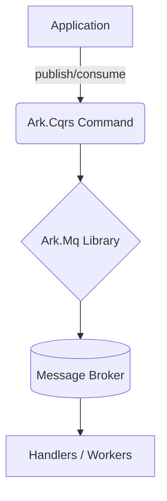

# ArkAlliance Core- Ark.Alliance.Core.Mq

This folder groups infrastructure libraries that integrate with various message brokers. Each library follows Clean Architecture principles and exposes Ark.Cqrs commands so that your application code remains decoupled from the messaging implementation.
## Functional summary
- Set of message broker adapters built on Ark.Cqrs.
- Allows event-driven microservices or distributed workflows.
- Domain code remains agnostic to broker choice.

## Available Libraries
```
Ark.Mq.Emqx5/   # MQTT wrappers
Ark.Mq.RabbitMq/ # RabbitMQ helpers
Ark.Mq.RocketMq/ # RocketMQ helpers
Ark.Mq.ZeroMq/   # ZeroMQ helpers
```

- **Ark.Mq.RabbitMq** – RabbitMQ client helpers.
- **Ark.Mq.RocketMq** – RocketMQ integration helpers.
- **Ark.Mq.Emqx5** – MQTT helpers targeting the EMQX 5 broker.
- **Ark.Mq.ZeroMq** – ZeroMQ socket helpers.

## Architecture Overview



Each Ark.Mq package implements the message bus pattern by using Ark.Cqrs to dispatch commands and events. Publishers and consumers are isolated in the infrastructure layer so your domain remains broker agnostic.
## Technical summary
- **Framework:** .NET 9
- **NuGet packages:** RabbitMQ.Client, Apache.RocketMQ.Client, MQTTnet
- **Architectures:** Clean Architecture, event-driven, CQRS
- **Typical usage:** back-end services, IoT gateways, distributed applications

### Project structure
```
Ark.Mq.RabbitMq/   # RabbitMQ helpers
Ark.Mq.RocketMq/   # RocketMQ helpers
Ark.Mq.Emqx5/      # MQTT (EMQX 5) helpers
Ark.Mq.ZeroMq/     # ZeroMQ helpers
```

Each subfolder contains:
- `ConnectionPool/` and `ChannelPool/` – connection management and resilience
- `Publisher/` – services to publish messages
- `Consumer/` – background consumers and message handlers


## Broker Comparison

The table below summarises the typical use cases and characteristics of each
broker targeted by these libraries.

| Library | Broker/Technology | Typical Use Cases | Target Platforms | Pros | Cons | Cost |
|--------|------------------|------------------|-----------------|-----|-----|-----|
| `Ark.Mq.RabbitMq` | RabbitMQ | Classic microservice integration, delayed messaging | Windows, Linux, macOS, ARM, Docker | Rich routing (`topics`, `headers`), lightweight footprint | Lower throughput than Kafka/Pulsar, Erlang clustering tuning | Open source |
| `Ark.Mq.RocketMq` | Apache RocketMQ 5 | Streaming and IoT bridging | Java based; Windows, Linux, macOS, ARM64 (Docker) | &lt;1&nbsp;ms latency, cloud native design | Requires JVM, smaller community than Kafka | Open source |
| `Ark.Mq.Emqx5` | EMQX&nbsp;5 (MQTT) | IoT and device telemetry | Erlang based; Windows, Linux, macOS, ARM64, Kubernetes | Scales to 100&nbsp;M connections, bridges to RocketMQ/Kafka | Binary &gt;60&nbsp;MB, high RAM usage | Open core |
| `Ark.Mq.ZeroMq` | ZeroMQ | Lightweight messaging on constrained devices | C/C++; Windows, Linux, macOS, Android NDK, MCU via RIOT‑OS | Very low latency, simple patterns (PUSH/PULL, REQ/REP) | No persistence or built‑in security | Open source |
### Choosing a broker
- **RabbitMQ**: reliable microservice communication.
- **RocketMQ**: streaming and very low latency.
- **Emqx5**: high volume IoT telemetry.
- **ZeroMQ**: ultra lightweight and no persistence.


## Server Requirements

Each library requires the corresponding broker to be installed and reachable. Ensure the broker credentials and host names are configured in your application settings.

## Windows Service Integration Example

The libraries can be used in a background service or Windows service. A minimal setup using `HostApplicationBuilder` is shown below:

```csharp
var builder = Host.CreateApplicationBuilder(args);
builder.Services.AddArkRabbitMq(options => builder.Configuration.GetSection("RabbitMq").Bind(options));
// register other broker libraries similarly
builder.Services.AddHostedService<Worker>();
await builder.Build().RunAsync();
```

Where `Worker` is your `BackgroundService` that publishes or consumes messages.

## Sample Configuration

```json
{
  "RabbitMq": {
    "Host": "localhost",
    "Port": 5672,
    "UserName": "guest",
    "Password": "guest"
  },
  "RocketMq": {
    "NameServer": "localhost:9876"
  },
  "Emqx5": {
    "Host": "localhost",
    "Port": 1883
  },
  "ZeroMq": {
    "Endpoint": "tcp://localhost:5555"
  }
}
```

Use the appropriate section for each library you reference.

## Author

Armand Richelet-Kleinberg
