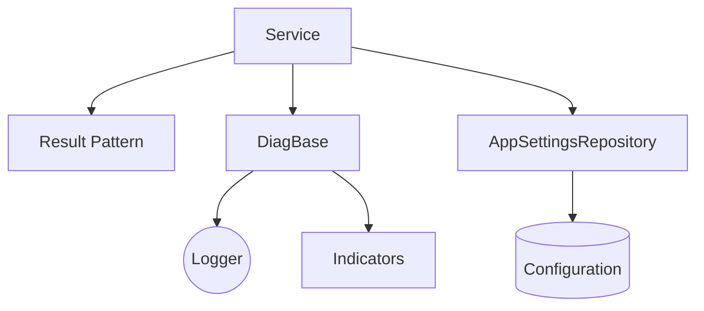
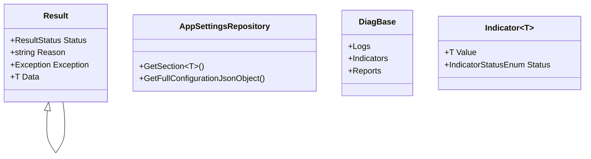
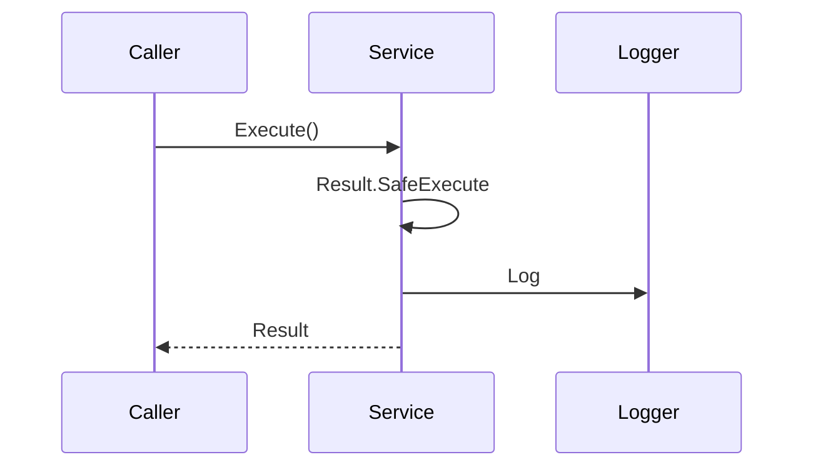

# Ark.Alliance.Core : ArkAllianceEcosystem

## Introduction
Ark.Alliance.Core provides foundational utilities for building reliable services on **.NET 9** and C# 13. It embraces **Domain‑Driven Design**, **Event‑Driven Architecture** and **Clean Architecture** principles. The library focuses on common patterns such as result handling, diagnostics and configuration to ensure modularity, flexibility and maintainability. It participates in the ArkAlliance ecosystem which promotes a hybrid AI/human workflow through YAML or JSON models and conversational interactions.

*Reference date: July 21, 2025*

## Index
1. [General Description](#general-description)
2. [Project Structure](#project-structure)
3. [Functional Diagram](#functional-diagram)
4. [Class Diagram](#class-diagram)
5. [UML Sequence Diagram](#uml-sequence-diagram)
6. [Code Examples](#code-examples)
7. [Table of Components](#table-of-components)
8. [Dependencies](#dependencies)
9. [Licenses and Acknowledgments](#licenses-and-acknowledgments)
10. [Release](#release)

## General Description
### Main Features
- **Core Operations**
  - Strongly typed `Result` and `Result<T>` classes with fluent helpers.
  - Diagnostics base classes to expose loggers, indicators and reports.
  - `AppSettingsRepository` for typed configuration sections and full configuration snapshots.
- **Extended Features**
  - Reflection‑based initialization of loggers and indicators.
  - Reports returning `Result` objects for easy integration with services.
- **Service Specific**
  - Minimal dependencies so components can be used in console tools or microservices.

### Use Cases
- Provide consistent error handling across multiple services.
- Centralise health indicators and application reports for monitoring.
- Load configuration sections without duplicating boilerplate code.

## Project Structure
```
Ark.Alliance.Core/
|-- Enums/            # Diagnostic and logging enums
|-- Extensions/       # Helper extensions for collections and types
|-- Models/           # DTOs and configuration helpers
|-- Patterns/
    |-- Result/       # Result pattern implementation
    |-- Diagnostics/  # Loggers, indicators and reports
```
### Compliance
- **DDD** – core patterns are domain agnostic and infrastructure concerns are isolated.
- **Event‑Driven** – diagnostics can publish events and indicators to other services.
- **Clean Architecture** – code is organised to keep dependencies pointed inward.

## Functional Diagram


## Class Diagram


## UML Sequence Diagram


## Code Examples
```csharp
// Creating a result
Result<int> result = Result<int>.SafeExecute(() => new Result<int>().WithData(42));
if (result.IsSuccess)
    Console.WriteLine(result.Data);
```
```csharp
// Defining diagnostics
public class MyDiag : DiagBase<MyLoggers, MyIndicators, MyReports> { }
MyDiag.Init();
MyDiag.Logs.General.LogInformation("started");
var status = MyDiag.Indicators.Sample.Status;
```
```csharp
// AppSettings section
public class MySettings : AppSettingsSectionBase
{
    public override string SectionPath => "MySettings";
    public string Endpoint { get; set; }
}
var repo = new AppSettingsRepository();
MySettings cfg = repo.GetSection<MySettings>();
```
```json
// appsettings.json snippet
{
  "MySettings": {
    "Endpoint": "https://api.test.local"
  }
}
```
```csharp
// Full configuration dump
ExpandoObject config = repo.GetFullConfigurationJsonObject();
```

### Use cases
These snippets demonstrate result creation, diagnostics initialization and loading of typed configuration sections.

## Table of Components
| Component | Description |
| --------- | ----------- |
| **Result Pattern** | Unified result object with helpers for error handling. |
| **Diagnostics** | Base classes for loggers, indicators and reports. |
| **AppSettingsRepository** | Central access to configuration sections. |

## Dependencies
- Microsoft.Extensions.Configuration 9.0.6
- Microsoft.Extensions.Logging.Abstractions 9.0.0

## Licenses and Acknowledgments
Ark.Alliance.Core is released under the [MIT License](../LICENSE.txt). This README was partially generated with the assistance of arkr (xAI) and manually reviewed for accuracy.

## Release
- 2025-03-21 Initial documentation for Ark.Alliance.Core.

*Author: Armand Richelet-Kleinberg*

