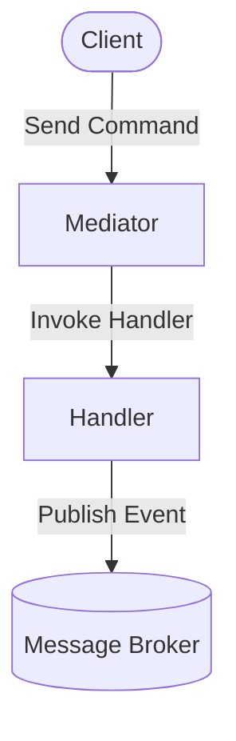
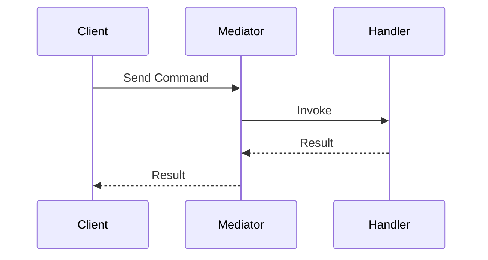

Parfait. Je vais restructurer le document avec :

* Des icônes Font Awesome insérées via HTML pour un rendu plus professionnel,
* Des diagrammes Mermaid au style affiné tout en restant compatibles GitHub,
* Des barres de progression en HTML dans les tableaux (ex: <progress>) pour refléter les niveaux/priorités.

Je vous tiens informé dès que la version retravaillée est prête.


**Ark Alliance Mediator** is a lightweight .NET 9 mediator built for domain-driven design and event-driven architectures. It generates handler registrations at compile time, ships with resilience middleware and optionally integrates machine learning pipelines.

> <i class="fas fa-exclamation-triangle"></i> **Status: Alpha** – APIs and features may change.

## Table of Contents

1. [Overview](#overview)
2. [Executive Summary](#executive-summary)
3. [Comparative Analysis](#comparative-analysis)
4. [Strategic Decisions](#strategic-decisions)
5. [Architecture](#architecture)
6. [Quick Start](#quick-start)
7. [Machine Learning & AI](#machine-learning--ai)
8. [Project Overview](#project-overview)
9. [Dependencies](#dependencies)
10. [Development Roadmap](#development-roadmap)
11. [Testing & Benchmarks](#testing--benchmarks)
12. [License](#license)
13. [SDLC](#sdlc)

## Overview

## Executive Summary

Ark.Alliance.Core.Mediator represents a promising .NET 9 mediator framework with compile-time code generation capabilities.

Currently in Alpha status, the project is refocusing efforts to achieve market viability.

This analysis provides a comprehensive comparison with existing solutions and outlines a concrete 1-month implementation plan centered around plugin architecture and broker integration.

## Comparative Analysis

### Core Framework Comparison

| **Criteria**          | **Ark.Alliance**                                    | **MediatR v13**                          | **Wolverine**                           | **LiteBus**                  | **Cortex.Mediator**          |
| --------------------- | --------------------------------------------------- | ---------------------------------------- | --------------------------------------- | ---------------------------- | ---------------------------- |
| **General**           |                                                     |                                          |                                         |                              |                              |
| License               | MIT                                                 | Commercial                               | MIT                                     | MIT                          | MIT                          |
| Status                | Alpha                                               | Stable                                   | Stable                                  | Stable                       | Stable                       |
| Community             | Nascent                                             | Extensive                                | Growing                                 | Small                        | Small                        |
| **Performance**       |                                                     |                                          |                                         |                              |                              |
| Dispatch Time         | \~10ns (estimated)                                  | \~150ns                                  | \~10ns                                  | \~5ns                        | \~8ns                        |
| Startup Time          | 10× faster                                          | Reflection-based                         | 146× faster                             | 20× faster                   | 15× faster                   |
| Memory Usage          | Optimized                                           | Standard                                 | Highly optimized                        | Optimized                    | Optimized                    |
| AOT Compatible        | <i class="fas fa-check"></i>                        | *Limited*                                | <i class="fas fa-check"></i>            | <i class="fas fa-check"></i> | <i class="fas fa-check"></i> |
| **Core Features**     |                                                     |                                          |                                         |                              |                              |
| CQRS Support          | <i class="fas fa-check"></i>                        | <i class="fas fa-check"></i>             | <i class="fas fa-check"></i>            | <i class="fas fa-check"></i> | <i class="fas fa-check"></i> |
| Pipeline/Middleware   | <i class="fas fa-check"></i>                        | <i class="fas fa-check"></i> *Behaviors* | <i class="fas fa-check"></i>            | <i class="fas fa-times"></i> | <i class="fas fa-check"></i> |
| Notifications         | <i class="fas fa-check"></i>                        | <i class="fas fa-check"></i>             | <i class="fas fa-check"></i>            | <i class="fas fa-times"></i> | <i class="fas fa-check"></i> |
| Streaming             | <i class="fas fa-check"></i>                        | <i class="fas fa-times"></i>             | <i class="fas fa-check"></i>            | <i class="fas fa-times"></i> | <i class="fas fa-times"></i> |
| Source Generators     | <i class="fas fa-check"></i>                        | <i class="fas fa-times"></i>             | <i class="fas fa-check"></i>            | <i class="fas fa-check"></i> | <i class="fas fa-check"></i> |
| **Connectivity**      |                                                     |                                          |                                         |                              |                              |
| RabbitMQ              | <i class="fas fa-hourglass-half"></i> *In Progress* | <i class="fas fa-wrench"></i> *Manual*   | <i class="fas fa-check"></i>            | <i class="fas fa-times"></i> | <i class="fas fa-times"></i> |
| Apache Kafka          | <i class="fas fa-hourglass-start"></i> *Planned*    | <i class="fas fa-wrench"></i> *Manual*   | <i class="fas fa-check"></i>            | <i class="fas fa-times"></i> | <i class="fas fa-times"></i> |
| IBM MQ Series         | <i class="fas fa-hourglass-half"></i> *In Progress* | <i class="fas fa-wrench"></i> *Manual*   | <i class="fas fa-times"></i>            | <i class="fas fa-times"></i> | <i class="fas fa-times"></i> |
| Azure Service Bus     | <i class="fas fa-hourglass-half"></i> *In Progress* | <i class="fas fa-wrench"></i> *Manual*   | <i class="fas fa-check"></i>            | <i class="fas fa-times"></i> | <i class="fas fa-times"></i> |
| Amazon SQS            | <i class="fas fa-ban"></i> *Not Planned*            | <i class="fas fa-wrench"></i> *Manual*   | *Limited*                               | <i class="fas fa-times"></i> | <i class="fas fa-times"></i> |
| In-Memory             | <i class="fas fa-check"></i>                        | <i class="fas fa-check"></i>             | <i class="fas fa-check"></i>            | <i class="fas fa-check"></i> | <i class="fas fa-check"></i> |
| **Resilience**        |                                                     |                                          |                                         |                              |                              |
| Retry Policies        | <i class="fas fa-check"></i> *Polly Integration*    | <i class="fas fa-wrench"></i> *Manual*   | <i class="fas fa-check"></i> *Built-in* | <i class="fas fa-times"></i> | <i class="fas fa-times"></i> |
| Circuit Breaker       | <i class="fas fa-check"></i>                        | <i class="fas fa-wrench"></i> *Manual*   | <i class="fas fa-check"></i>            | <i class="fas fa-times"></i> | <i class="fas fa-times"></i> |
| Timeout Handling      | <i class="fas fa-check"></i>                        | <i class="fas fa-wrench"></i> *Manual*   | <i class="fas fa-check"></i>            | <i class="fas fa-times"></i> | <i class="fas fa-times"></i> |
| Bulkhead              | <i class="fas fa-hourglass-start"></i> *Planned*    | <i class="fas fa-wrench"></i> *Manual*   | <i class="fas fa-check"></i>            | <i class="fas fa-times"></i> | <i class="fas fa-times"></i> |
| **Observability**     |                                                     |                                          |                                         |                              |                              |
| Structured Logging    | <i class="fas fa-check"></i> *Integrated*           | <i class="fas fa-wrench"></i> *Manual*   | <i class="fas fa-check"></i>            | <i class="fas fa-times"></i> | <i class="fas fa-times"></i> |
| Metrics               | <i class="fas fa-check"></i> *OpenTelemetry*        | <i class="fas fa-wrench"></i> *Manual*   | <i class="fas fa-check"></i>            | <i class="fas fa-times"></i> | <i class="fas fa-times"></i> |
| Distributed Tracing   | <i class="fas fa-check"></i>                        | <i class="fas fa-wrench"></i> *Manual*   | <i class="fas fa-check"></i>            | <i class="fas fa-times"></i> | <i class="fas fa-times"></i> |
| Health Checks         | <i class="fas fa-check"></i>                        | <i class="fas fa-wrench"></i> *Manual*   | *Limited*                               | <i class="fas fa-times"></i> | <i class="fas fa-times"></i> |
| **Advanced Features** |                                                     |                                          |                                         |                              |                              |
| AI/ML Pipeline        | <i class="fas fa-hourglass-half"></i> *In Progress* | <i class="fas fa-times"></i>             | <i class="fas fa-times"></i>            | <i class="fas fa-times"></i> | <i class="fas fa-times"></i> |
| Service Orchestrator  | <i class="fas fa-check"></i>                        | <i class="fas fa-times"></i>             | *Limited*                               | <i class="fas fa-times"></i> | <i class="fas fa-times"></i> |
| Multi-tenancy         | <i class="fas fa-hourglass-start"></i> *Planned*    | <i class="fas fa-times"></i>             | <i class="fas fa-check"></i>            | <i class="fas fa-times"></i> | <i class="fas fa-times"></i> |
| **Economics**         |                                                     |                                          |                                         |                              |                              |
| License Cost          | Free                                                | \$1000+/project                          | Free                                    | Free                         | Free                         |
| Support Model         | Community                                           | Commercial                               | Community                               | Community                    | Community                    |
| Learning Curve        | High                                                | Low                                      | Medium                                  | Low                          | Low                          |

### Broker Integration Capabilities

| **Message Broker** | **Ark.Alliance**                                    | **Market Share**                               | **Enterprise Usage** | **Implementation Priority** |
| ------------------ | --------------------------------------------------- | ---------------------------------------------- | -------------------- | --------------------------- |
| RabbitMQ           | <i class="fas fa-hourglass-half"></i> *In Progress* | <progress value="35" max="100"></progress> 35% | High                 | High                        |
| Apache Kafka       | <i class="fas fa-hourglass-start"></i> *Planned*    | <progress value="25" max="100"></progress> 25% | Very High            | High                        |
| IBM MQ Series      | <i class="fas fa-hourglass-half"></i> *In Progress* | <progress value="15" max="100"></progress> 15% | Very High            | Medium                      |
| Azure Service Bus  | <i class="fas fa-hourglass-half"></i> *In Progress* | <progress value="12" max="100"></progress> 12% | High                 | Medium                      |
| Amazon SQS/SNS     | <i class="fas fa-hourglass-start"></i> *Planned*    | <progress value="8" max="100"></progress> 8%   | High                 | Low                         |
| Redis Streams      | <i class="fas fa-hourglass-half"></i> *In Progress* | <progress value="3" max="100"></progress> 3%   | Medium               | Low                         |
| NATS               | <i class="fas fa-hourglass-start"></i> *Planned*    | <progress value="2" max="100"></progress> 2%   | Low                  | Low                         |

## Strategic Decisions

### Priority 1: Architecture Simplification

**Current State**: Monolithic architecture with 334 files and 1.4 MB bundle size
**Target State**: Modular plugin-based architecture with \~50 core files and 200 KB base bundle
**Key Changes**:

* Extract AI/ML, Diagnostics, and Orchestrator into **optional plugins**.
* **Implement a generic middleware pipeline with plugin discovery**.
* Maintain backward compatibility with current APIs during transition.

### Priority 2: Market Positioning

**Value Proposition**: *"The only .NET mediator with true plugin extensibility and enterprise broker support."*

**Competitive Advantages**:

* MIT license (avoiding MediatR's commercial licensing).
* Compile-time code generation for superior performance.
* Enterprise-grade broker integrations out-of-the-box.
* Plugin ecosystem enabling community contributions.

### Priority 3: Enterprise Broker Support

**Target Brokers** (in order of implementation):

1. RabbitMQ (complete existing implementation).
2. Apache Kafka (new implementation).
3. IBM MQ Series (complete existing implementation).
4. Azure Service Bus (complete existing implementation).

## Architecture





## Quick Start

```csharp
var dispatcher = services.GetRequiredService<IArkDispatcher>();
await dispatcher.SendAsync(new PingCommand());
```

```csharp
services.AddRetryCommandMiddleware(o => o.RetryCount = 3);
```

```csharp
await foreach (var n in dispatcher.CreateStream(new NumberStreamRequest(5)))
    Console.WriteLine(n);
```

## Machine Learning & AI


When enabled, `MlDataMiddleware` records command and query payloads and forwards them to **Azure Event Hubs**. Data can be stored in a lake or vector database, then models are trained with **Azure Machine Learning** pipelines. Predictions are exposed through implementations of `ICommandDecisionService` and consumed by `AiCommandMiddleware`. Tasks for this pipeline are tracked in [Todo.md](Todo.md) and the ML sections of the [\_SDLC](./_SDLC/README.md).

The AI layer can also run on edge devices to support fog architectures, making this mediator a natural fit for scenarios that require decisions close to the data source.

## Project Overview

### Core Libraries

| Library                                               | Description                             | Docs                                                                                             | Status                             |
| ----------------------------------------------------- | --------------------------------------- | ------------------------------------------------------------------------------------------------ | ---------------------------------- |
| **Ark.Alliance.Core.Mediator.Messaging**              | CQRS dispatcher and middleware pipeline | [README](Ark.Alliance.Core.Mediator/Ark.Alliance.Core.Mediator.Messaging/README.md)              | <i class="fas fa-flask"></i> Alpha |
| **Ark.Alliance.Core**                                 | Diagnostics and configuration helpers   | [README](Ark.Alliance.Core/README.md)                                                            | <i class="fas fa-flask"></i> Alpha |
| **Ark.Alliance.Core.Mediator.IoC**                    | Dependency injection helpers            | [README](Ark.Alliance.Core.Mediator/Ark.Alliance.Core.Mediator.IoC/README.md)                    | <i class="fas fa-flask"></i> Alpha |
| **Ark.Alliance.Core.Mediator.Messaging.Abstractions** | Broker contracts                        | [README](Ark.Alliance.Core.Mediator/Ark.Alliance.Core.Mediator.Messaging.Abstractions/README.md) | <i class="fas fa-flask"></i> Alpha |
| **Ark.Alliance.Core.Mediator.Messaging.Streaming**    | In-memory streams                       | [README](Ark.Alliance.Core.Mediator/Ark.Alliance.Core.Mediator.Messaging.Streaming/README.md)    | <i class="fas fa-flask"></i> Alpha |

### Integration Libraries

| Library                           | Description             | Docs                                                                   | Status                             |
| --------------------------------- | ----------------------- | ---------------------------------------------------------------------- | ---------------------------------- |
| **Ark.Alliance.Core.Mq**          | Broker integration base | [README](Ark.Alliance.Core.Mq/README.md)                               | <i class="fas fa-flask"></i> Alpha |
| **Ark.Alliance.Core.Mq.RabbitMq** | RabbitMQ adapter        | [README](Ark.Alliance.Core.Mq/Ark.Alliance.Core.Mq.RabbitMq/README.md) | <i class="fas fa-flask"></i> Alpha |

### Tooling and Services

| Library                                              | Description                               | Docs                                                                                            | Status                             |
| ---------------------------------------------------- | ----------------------------------------- | ----------------------------------------------------------------------------------------------- | ---------------------------------- |
| **Ark.Alliance.Core.Mediator.Generators**            | Source generator for registration         | [README](Ark.Alliance.Core.Mediator/Ark.Alliance.Core.Mediator.Generators/README.md)            | <i class="fas fa-flask"></i> Alpha |
| **Ark.Alliance.Core.Mediator.Services.Orchestrator** | Microservice host environment             | [README](Ark.Alliance.Core.Mediator/Ark.Alliance.Core.Mediator.Services.Orchestrator/README.md) | <i class="fas fa-flask"></i> Alpha |
| **Ark.Alliance.Core.Mediator.ML**                    | Telemetry middleware and Event Hub worker | [README](Ark.Alliance.Core.Mediator/Ark.Alliance.Core.Mediator.ML/README.md)                    | <i class="fas fa-flask"></i> Alpha |

### Quality Assurance

| Library                                   | Description                | Docs                                                                                 | Status                             |
| ----------------------------------------- | -------------------------- | ------------------------------------------------------------------------------------ | ---------------------------------- |
| **Ark.Alliance.Core.Mediator.Benchmarks** | Throughput benchmarks      | [README](Ark.Alliance.Core.Mediator/Ark.Alliance.Core.Mediator.Benchmarks/README.md) | <i class="fas fa-flask"></i> Alpha |
| **Ark.Alliance.Core.Mediator.Tests**      | Unit test suite            | [README](Ark.Alliance.Core.Mediator/Ark.Alliance.Core.Mediator.Tests/README.md)      | <i class="fas fa-flask"></i> Alpha |
| **Ark.Alliance.Core.Mq.RabbitMq.Test**    | RabbitMQ integration tests | [README](Ark.Alliance.Core.Mq/Ark.Alliance.Core.Mq.RabbitMq.Test/README.md)          | <i class="fas fa-flask"></i> Alpha |

## Dependencies

* Microsoft.Extensions.DependencyInjection.Abstractions 9.0.6
* Microsoft.Extensions.Configuration 9.0.6
* Microsoft.Extensions.Resilience 9.6.0
* Polly 7.2.3
* Microsoft.CodeAnalysis.CSharp 4.8.0
* Testcontainers 4.6.0 (integration tests)

### Generator Optimization

The `Ark.Alliance.Core.Mediator.Generators` project generates optimized runtime and hybrid sources in the `optimized_generators` folder.

## Development Roadmap

| ID  | Task                                                   | Status                                                                                  |
| --- | ------------------------------------------------------ | --------------------------------------------------------------------------------------- |
| M3  | Batch telemetry and send to Event Hubs                 | <i class="fas fa-hourglass-half"></i> In Progress                                       |
| M5  | Populate vector store for semantic search              | <i class="fas fa-hourglass-start"></i> Planned                                          |
| 5   | Implement broker adapters and integration tests        | Open                                                                                    |
| 8   | Remove reflection in streaming and broker registration | Open                                                                                    |
| 20  | Style and security audit                               | Open                                                                                    |
| GD1 | Generator debugging tasks                              | <i class="fas fa-check"></i> Closed *(See [DebugGeneratorTodo](DebugGeneratorTodo.md))* |

## Testing & Benchmarks

Run `dotnet test` to execute the suite in **Ark.Alliance.Core.Mediator.Tests**. Performance measurements are provided in the benchmarks project, which compares dispatcher throughput to MediatR. Troubleshooting steps for container-based tests are described in [`testcontainers_troubleshooting_procedure.md`](./_SDLC/04_Testing/testcontainers_troubleshooting_procedure.md). The full setup guide for running Testcontainers locally or in CI is available in [`testcontainers_dotnet_9.md`](./_SDLC/04_Testing/testcontainers_dotnet_9.md). For local development, a helper script [`_Tools/install-testcontainers-deps.ps1`](./_Tools/install-testcontainers-deps.ps1) is provided to install Docker and the .NET SDK required by the RabbitMQ tests.

## License

Released under the [MIT License](LICENSE.txt). This project relies on permissive libraries such as [Polly](https://github.com/App-vNext/Polly) and [Microsoft.Extensions](https://github.com/dotnet/runtime). Integration tests make use of the MIT-licensed [Testcontainers for .NET](https://github.com/testcontainers/testcontainers-dotnet) project by **Richard Lander** and contributors.

## SDLC

This directory documents our full Software Development Life Cycle (planning, design, implementation, testing, deployment, and maintenance).

## Author

Armand Richelet-Kleinberg
