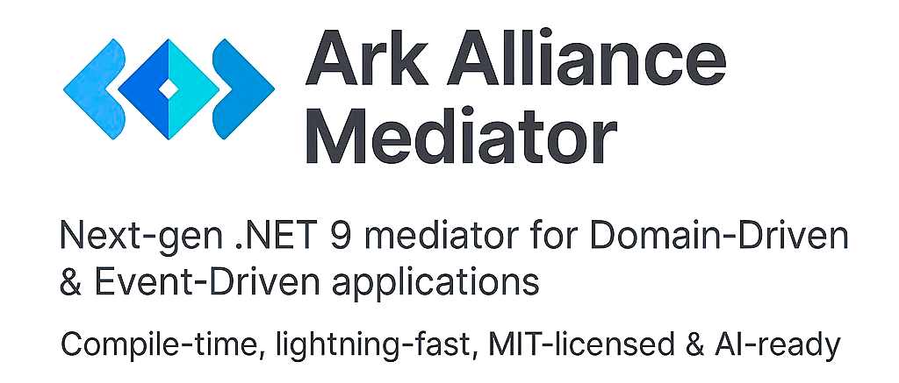
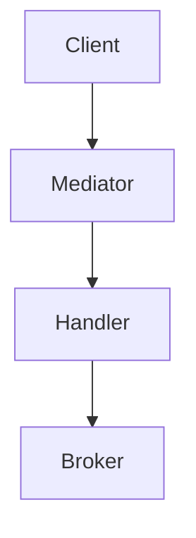
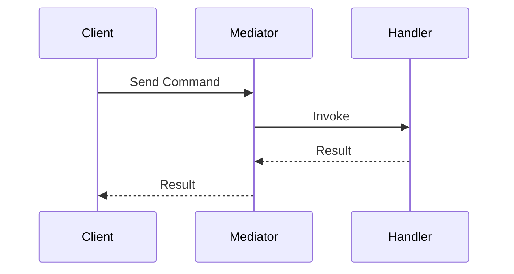

# Ark Alliance Mediator



**Ark Alliance Mediator** is a lightweight .NET&nbsp;9 mediator built for domain-driven design and event-driven architectures. It generates handler registrations at compile time, ships with resilience middleware and optionally integrates machine learning pipelines.
> **Status: Alpha** – APIs and features may change.

## Table of Contents
1. [Overview](#overview)
2. [Executive Summary](#executive-summary)
3. [Comparative Analysis](#comparative-analysis)
4. [Strategic Decisions](#strategic-decisions)
5. [Architecture](#architecture)
6. [Quick Start](#quick-start)
7. [Machine Learning & AI](#machine-learning--ai)
8. [Project Overview](#project-overview)
9. [Dependencies](#dependencies)
10. [Development Roadmap](#development-roadmap)
11. [Testing & Benchmarks](#testing--benchmarks)
12. [License](#license)
13. [SDLC](#sdlc)

## Overview

## Executive Summary

Ark.Alliance.Core.Mediator represents a promising .NET 9 mediator framework with compile-time code generation capabilities. 

Currently in Alpha status, the project  refocusing to achieve market viability. 

This analysis provides a comprehensive comparison with existing solutions and outlines a concrete 1-month implementation plan centered around plugin architecture and broker integration.

## Comparative Analysis

### Core Framework Comparison

| **Criteria** | **Ark.Alliance** | **MediatR v13** | **Wolverine** | **LiteBus** | **Cortex.Mediator** |
|--------------|------------------|-----------------|---------------|-------------|---------------------|
| **General** |||||
| License | MIT | Commercial | MIT | MIT | MIT |
| Status | Alpha | Stable | Stable | Stable | Stable |
| Community | Nascent | Extensive | Growing | Small | Small |
| **Performance** |||||
| Dispatch Time | ~15ns (estimated) | ~150ns | ~10ns | ~5ns | ~8ns |
| Startup Time | 10x faster | Reflection-based | 146x faster | 20x faster | 15x faster |
| Memory Usage | Optimized | Standard | Highly optimized | Optimized | Optimized |
| AOT Compatible | Yes | Limited | Yes | Yes | Yes |
| **Core Features** |||||
| CQRS Support | Yes | Yes | Yes | Yes | Yes |
| Pipeline/Middleware | Yes | Behaviors | Yes | No | Yes |
| Notifications | Yes | Yes | Yes | No | Yes |
| Streaming | Yes | No | Yes | No | No |
| Source Generators | Yes | No | Yes | Yes | Yes |
| **Connectivity** |||||
| RabbitMQ | In Progress | Manual | Yes | No | No |
| Apache Kafka | Planned | Manual | Yes | No | No |
| IBM MQ Series | Not Planned | Manual | No | No | No |
| Azure Service Bus | Not Planned | Manual | Yes | No | No |
| Amazon SQS | Not Planned | Manual | Limited | No | No |
| In-Memory | Yes | Yes | Yes | Yes | Yes |
| **Resilience** |||||
| Retry Policies | Polly Integration | Manual | Built-in | No | No |
| Circuit Breaker | Yes | Manual | Yes | No | No |
| Timeout Handling | Yes | Manual | Yes | No | No |
| Bulkhead | Planned | Manual | Yes | No | No |
| **Observability** |||||
| Structured Logging | Integrated | Manual | Yes | No | No |
| Metrics | OpenTelemetry | Manual | Yes | No | No |
| Distributed Tracing | Yes | Manual | Yes | No | No |
| Health Checks | Yes | Manual | Limited | No | No |
| **Advanced Features** |||||
| AI/ML Pipeline | In Progress | No | No | No | No |
| Service Orchestrator | Yes | No | Limited | No | No |
| Multi-tenancy | Planned | No | Yes | No | No |
| **Economics** |||||
| License Cost | Free | $1000+/project | Free | Free | Free |
| Support Model | Community | Commercial | Community | Community | Community |
| Learning Curve | High | Low | Medium | Low | Low |

### Broker Integration Capabilities

| **Message Broker** | **Ark.Alliance** | **Market Share** | **Enterprise Usage** | **Implementation Priority** |
|-------------------|------------------|------------------|---------------------|----------------------------|
| RabbitMQ | In Progress | 35% | High | High |
| Apache Kafka | Planned | 25% | Very High | High |
| IBM MQ Series | Not Planned | 15% | Very High | Medium |
| Azure Service Bus | Not Planned | 12% | High | Medium |
| Amazon SQS/SNS | Not Planned | 8% | High | Low |
| Redis Streams | Not Planned | 3% | Medium | Low |
| NATS | Not Planned | 2% | Low | Low |

## Strategic Decisions

### Priority 1: Architecture Simplification

**Current State**: Monolithic architecture with 334 files and 1.4MB bundle size
**Target State**: Modular plugin-based architecture with ~50 core files and 200KB base bundle

**Key Changes**:
- Extract AI/ML, Diagnostics, and Orchestrator into optional plugins
- Implement generic middleware pipeline with plugin discovery
- Maintain backward compatibility with current APIs during transition

### Priority 2: Market Positioning

**Value Proposition**: "The only .NET mediator with true plugin extensibility and enterprise broker support"

**Competitive Advantages**:
- MIT license (avoiding MediatR's commercial licensing)
- Compile-time code generation for superior performance
- Enterprise-grade broker integrations out-of-the-box
- Plugin ecosystem enabling community contributions

### Priority 3: Enterprise Broker Support

**Target Brokers** (in order of implementation):
1. RabbitMQ (complete existing implementation)
2. Apache Kafka (new implementation)
3. IBM MQ Series (enterprise focus)
4. Azure Service Bus (cloud integration)


## Architecture




## Quick Start
```csharp
var dispatcher = services.GetRequiredService<IArkDispatcher>();
await dispatcher.SendAsync(new PingCommand());
```
```csharp
services.AddRetryCommandMiddleware(o => o.RetryCount = 3);
```
```csharp
await foreach (var n in dispatcher.CreateStream(new NumberStreamRequest(5)))
    Console.WriteLine(n);
```

## Machine Learning & AI


When enabled, `MlDataMiddleware` records command and query payloads and forwards them to **Azure Event Hubs**. Data can be stored in a lake or vector database, then models are trained with **Azure Machine Learning** pipelines. Predictions are exposed through implementations of `ICommandDecisionService` and consumed by `AiCommandMiddleware`. Tasks for this pipeline are tracked in [Todo.md](Todo.md) and the ML sections of the [_SDLC](./_SDLC/README.md).

The AI layer can also run on edge devices to support fog architectures, making this mediator a natural fit for scenarios that require decisions close to the data source.

## Project Overview

### Core Libraries
| Library | Description | Docs | Status |
| ------ | ----------- | ---- | ------ |
| **Ark.Alliance.Core.Mediator.Messaging** | CQRS dispatcher and middleware pipeline | [README](Ark.Alliance.Core.Mediator/Ark.Alliance.Core.Mediator.Messaging/README.md) | Alpha |
| **Ark.Alliance.Core** | Diagnostics and configuration helpers | [README](Ark.Alliance.Core/README.md) | Alpha |
| **Ark.Alliance.Core.Mediator.IoC** | Dependency injection helpers | [README](Ark.Alliance.Core.Mediator/Ark.Alliance.Core.Mediator.IoC/README.md) | Alpha |
| **Ark.Alliance.Core.Mediator.Messaging.Abstractions** | Broker contracts | [README](Ark.Alliance.Core.Mediator/Ark.Alliance.Core.Mediator.Messaging.Abstractions/README.md) | Alpha |
| **Ark.Alliance.Core.Mediator.Messaging.Streaming** | In-memory streams | [README](Ark.Alliance.Core.Mediator/Ark.Alliance.Core.Mediator.Messaging.Streaming/README.md) | Alpha |

### Integration Libraries
| Library | Description | Docs | Status |
| ------ | ----------- | ---- | ------ |
| **Ark.Alliance.Core.Mq** | Broker integration base | [README](Ark.Alliance.Core.Mq/README.md) | Alpha |
| **Ark.Alliance.Core.Mq.RabbitMq** | RabbitMQ adapter | [README](Ark.Alliance.Core.Mq/Ark.Alliance.Core.Mq.RabbitMq/README.md) | Alpha |

### Tooling and Services
| Library | Description | Docs | Status |
| ------ | ----------- | ---- | ------ |
| **Ark.Alliance.Core.Mediator.Generators** | Source generator for registration | [README](Ark.Alliance.Core.Mediator/Ark.Alliance.Core.Mediator.Generators/README.md) | Alpha |
| **Ark.Alliance.Core.Mediator.Services.Orchestrator** | Microservice host environment | [README](Ark.Alliance.Core.Mediator/Ark.Alliance.Core.Mediator.Services.Orchestrator/README.md) | Alpha |
| **Ark.Alliance.Core.Mediator.ML** | Telemetry middleware and Event Hub worker | [README](Ark.Alliance.Core.Mediator/Ark.Alliance.Core.Mediator.ML/README.md) | Alpha |

### Quality Assurance
| Library | Description | Docs | Status |
| ------ | ----------- | ---- | ------ |
| **Ark.Alliance.Core.Mediator.Benchmarks** | Throughput benchmarks | [README](Ark.Alliance.Core.Mediator/Ark.Alliance.Core.Mediator.Benchmarks/README.md) | Alpha |
| **Ark.Alliance.Core.Mediator.Tests** | Unit test suite | [README](Ark.Alliance.Core.Mediator/Ark.Alliance.Core.Mediator.Tests/README.md) | Alpha |
| **Ark.Alliance.Core.Mq.RabbitMq.Test** | RabbitMQ integration tests | [README](Ark.Alliance.Core.Mq/Ark.Alliance.Core.Mq.RabbitMq.Test/README.md) | Alpha |

## Dependencies
- Microsoft.Extensions.DependencyInjection.Abstractions 9.0.6
- Microsoft.Extensions.Configuration 9.0.6
- Microsoft.Extensions.Resilience 9.6.0
- Polly 7.2.3
- Microsoft.CodeAnalysis.CSharp 4.8.0
- Testcontainers 4.6.0 (integration tests)

### Generator Optimization
Run `python generator_optimizer.py` from
`Ark.Alliance.Core.Mediator/Ark.Alliance.Core.Mediator.Generators` to generate
optimized runtime and hybrid sources in the `optimized_generators` folder.

## Development Roadmap

| ID | Task | Status |
|----|------|-------|
| M3 | Batch telemetry and send to Event Hubs | In Progress |
| M5 | Populate vector store for semantic search | Planned |
| 5 | Implement broker adapters and integration tests | Open |
| 8 | Remove reflection in streaming and broker registration | Open |
| 20 | Style and security audit | Open |
| GD1 | Generator debugging tasks | Closed | See [DebugGeneratorTodo](DebugGeneratorTodo.md) |

## Testing & Benchmarks
Run `dotnet test` to execute the suite in **Ark.Alliance.Core.Mediator.Tests**. Performance measurements are found in the benchmarks project which compares dispatcher throughput to MediatR.
Troubleshooting steps for container based tests are described in [`testcontainers_troubleshooting_procedure.md`](./_SDLC/04_Testing/testcontainers_troubleshooting_procedure.md).
The full setup guide for running Testcontainers locally or in CI lives in [`testcontainers_dotnet_9.Md`](./_SDLC/04_Testing/testcontainers_dotnet_9.Md).
For local development you can run the helper script [`_Tools/install-testcontainers-deps.ps1`](./_Tools/install-testcontainers-deps.ps1) to install Docker and the .NET SDK required by the RabbitMQ tests.

## License
Released under the [MIT License](LICENSE.txt). This project relies on permissive
libraries such as [Polly](https://github.com/App-vNext/Polly) and
[Microsoft.Extensions](https://github.com/dotnet/runtime).
Integration tests make use of the MIT licensed
[Testcontainers for .NET](https://github.com/testcontainers/testcontainers-dotnet)
project by **Richard Lander** and contributors. 


## SDLC

This directory documents our full Software Development Life Cycle (planning, design, implementation, testing, deployment, and maintenance).

## Author

Armand Richelet-Kleinberg
