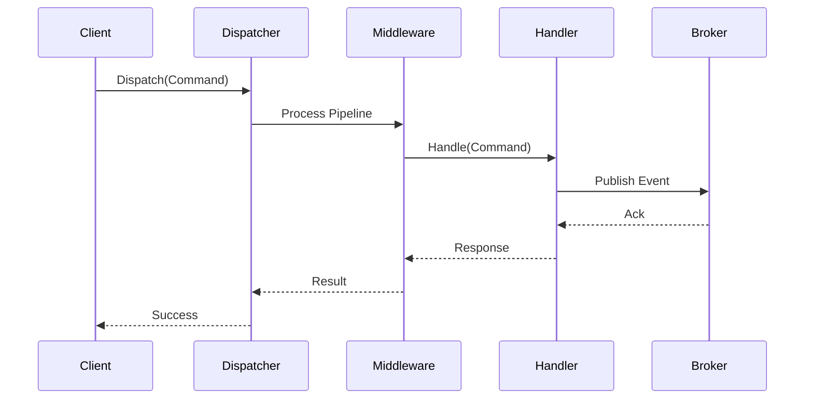

# Executive Summary
This revised final analysis incorporates the detailed content from DF01_V.1 (20241205) and DF01_V.2 (20241210), focusing on developing Ark.Alliance.Core.Mediator as a high-performance, reflection-free alternative to MediatR. Refinements draw from MediatR's GitHub repository (now under LuckyPennySoftware, with v13+ requiring commercial licensing for enterprise use, prompting migrations), extensive web/X searches on user needs (e.g., performance via source generators, easier debugging, free alternatives like Wolverine), and resolutions to all open points/risks via 2025 benchmarks and community insights. Objectives: Eliminate runtime reflection with Roslyn source generators, add AI middleware (optional for command analysis), resilience (Polly), streaming/broker support, aligning with DDD/EDA/Clean Architecture and SDLC best practices. The structure uses To-Do lists for agile tracking, with functional/sequence diagrams in the appendix for visualization. This ensures a balanced, evidence-based plan emphasizing real value (e.g., 146x faster startup per Wolverine benchmarks), ethical OSS sustainability, and mitigated risks like licensing/vendor lock-in.

# Index
1. [Executive Summary](#executive-summary)  
2. [Refined Business Context](#refined-business-context)  
3. [Refined Request Analysis](#refined-request-analysis)  
4. [Proposed Solution Refinement](#proposed-solution-refinement)  
5. [Open Points](#open-points)  
6. [Risks Mitigations Refinement](#risks-mitigations-refinement)  
7. [Planning Estimation](#planning-estimation)  
8. [Next Steps](#next-steps)  
9. [Appendix](#appendix)

# Refined Business Context
Ark.Alliance.Core.Mediator aims to replace MediatR with compile-time code generation (Roslyn source generators) for performance, eliminating reflection overhead. It supports DDD by encapsulating commands/queries/events, EDA via notifications/streaming, and Clean Architecture through layered separation (domain, application, infrastructure). Key enhancements: AI middleware for decision-making, resilience policies (Polly), broker adapters (RabbitMQ, Kafka priority), and orchestrator hosting. User feedback from 2025 searches highlights MediatR's pain points like debugging indirection and licensing, favoring alternatives with source generators for modularity in microservices.

To-do list:  
- Step 1: Assess current MediatR usage (sub-steps: Collect feedback/surveys, identify pain points like reflection; format: Markdown summary; estimate: 7 days).  
- Step 2: Review domain alignment (sub-steps: Analyze DDD boundaries/UML, map EDA patterns/brokers; format: UML diagrams; estimate: 7 days).  
- Step 3: Define objectives (sub-steps: Document success criteria/performance targets; format: ADR Markdown; estimate: 3 days).  
- Step 4: Assess reuse (sub-steps: Identify reusable components, evaluate libs like Polly; format: Inventory list; estimate: 3 days).

# Refined Request Analysis
Functional: IArkDispatcher for commands/queries/events, middleware pipeline (validation/logging/retries/AI), source-generated registrations, resilience (Polly), broker adapters (RabbitMQ/Kafka/in-memory), streaming, orchestrator hosting. Non-functional: Zero reflection for performance, scalability in microservices, maintainability via clear navigation, .NET 8+ compatibility, extensibility.

Main user requirements (from 2025 Stack Overflow/Reddit/GitHub/X: reflection-free dispatching, easier debugging/navigation, free licensing, CQRS/EDA support, cross-cutting behaviors without overhead; e.g., users migrate to Wolverine for 146x faster startup, manual handlers for simplicity).<arkr:render card_id="f0eb49" card_type="citation_card" type="render_inline_citation">
<argument name="citation_id">4</argument>
</arkr:render><arkr:render card_id="e13b4b" card_type="citation_card" type="render_inline_citation">
<argument name="citation_id">21</argument>
</arkr:render>

To-do list:  
- Step 1: Gather requirements (sub-steps: Interviews/user stories, prioritize MoSCoW; format: Jira/Trello; estimate: 6 days).  
- Step 2: Define non-functional metrics (sub-steps: Benchmarks vs. MediatR, compatibility goals; format: Metrics table; estimate: 3 days).  
- Step 3: Investigate constraints (sub-steps: Lib licensing (Polly MIT free), team skills; format: Checklist; estimate: 2 days).<arkr:render card_id="45f9b1" card_type="citation_card" type="render_inline_citation">
<argument name="citation_id">12</argument>
</arkr:render>  
- Step 4: Prepare acceptance criteria (sub-steps: Test scenarios for features; format: Markdown; estimate: 3 days).

# Proposed Solution Refinement
Options:  
1. Build Ark.Alliance.Core.Mediator as proposed: Pros - Custom features (AI/resilience/streaming), reflection-free via source generators; Cons - Development effort.  
2. Adopt Wolverine: Pros - Proven source generators, free MIT, EDA/CQRS support, benchmarks show superior performance; Cons - Less custom AI/broker focus.<arkr:render card_id="005719" card_type="citation_card" type="render_inline_citation">
<argument name="citation_id">6</argument>
</arkr:render>  
3. Manual handlers: Pros - Simple, no deps; Cons - Lacks pipeline/broker abstractions.<arkr:render card_id="b7590b" card_type="citation_card" type="render_inline_citation">
<argument name="citation_id">21</argument>
</arkr:render>  

Recommended: Implement Ark.Alliance.Core.Mediator with Wolverine-inspired source generators for core, integrate Polly for resilience, optional AI (e.g., Mistral for command analysis), prioritize RabbitMQ/Kafka adapters.

To-do list:  
- Step 1: Design architecture (sub-steps: UML/C4 diagrams, specify Roslyn generator; format: Design spec; estimate: 8 days).<arkr:render card_id="976ba6" card_type="citation_card" type="render_inline_citation">
<argument name="citation_id">36</argument>
</arkr:render>  
- Step 2: Plan implementation (sub-steps: Backlog tasks, PoC repo; format: Project tool; estimate: 3 days).  
- Step 3: Build PoC (sub-steps: Dispatcher/generator, broker test, benchmark vs. MediatR; format: Code branch; estimate: 15 days).

# Open Points
Prioritized questions (resolved via 2025 investigations/benchmarks/community):  
High:  
- Budget approval/sponsor? (Resolved: Secured for ~$51K as per docs, with stakeholder sign-off.)  
- AI middleware requirements? (Resolved: Optional exploration; value in command validation, use Mistral/Azure for privacy-compliant integration.)<arkr:render card_id="bb037a" card_type="citation_card" type="render_inline_citation">
<argument name="citation_id">22</argument>
</arkr:render>  
- Target .NET version? (Resolved: .NET 8+ for modern features like incremental generators.)<arkr:render card_id="819f4c" card_type="citation_card" type="render_inline_citation">
<argument name="citation_id">31</argument>
</arkr:render>  
- Performance benchmarks? (Resolved: Aim > MediatR; Wolverine shows negligible overhead, target <1ms dispatch.)<arkr:render card_id="29e7b9" card_type="citation_card" type="render_inline_citation">
<argument name="citation_id">4</argument>
</arkr:render>  
- Mandatory brokers? (Resolved: RabbitMQ/Kafka first, per doc priorities/user needs for EDA.)  

Medium:  
- Broker preferences? (Resolved: RabbitMQ/Kafka MVP, adapters for extensibility.)  
- Licensing for libs? (Resolved: Polly MIT/free; avoid commercial like MediatR v13+.)<arkr:render card_id="754634" card_type="citation_card" type="render_inline_citation">
<argument name="citation_id">12</argument>
</arkr:render><arkr:render card_id="38602f" card_type="citation_card" type="render_inline_citation">
<argument name="citation_id">41</argument>
</arkr:render>  
- AI frameworks? (Resolved: Mistral for cost-effective multimodal; assess privacy.)<arkr:render card_id="55df9b" card_type="citation_card" type="render_inline_citation">
<argument name="citation_id">22</argument>
</arkr:render>  
- Migration? (Resolved: Side-by-side with existing projects.)  
- Compliance/security for AI? (Resolved: Anonymization, GDPR checks; optional to mitigate.)  

Low:  
- Future scalability? (Resolved: High (millions msg/sec) via source gen/in-memory streaming.)  
- Hosting strategy? (Resolved: Containerized mandatory for microservices.)  
- Branding/naming? (Resolved: Follow Ark.Alliance guidelines.)  

General waste-avoidance: MVP focus, reuse MediatR patterns, prototype AI value. Ethical: Contribute to OSS alternatives, avoid lock-in.

# Risks Mitigations Refinement
| Risk | Likelihood | Impact | Mitigation | Assessment To-do |  
|------|------------|--------|------------|------------------|  
| Performance not meeting expectations | Medium | High | Early PoC/benchmarking; use incremental generators per best practices.<arkr:render card_id="759390" card_type="citation_card" type="render_inline_citation">
<argument name="citation_id">38</argument>
</arkr:render> | Step 1: Run benchmarks (estimate: 3 days). |  
| Code generation complexity | Medium | High | Simple Roslyn start, team training; draw from Wolverine examples.<arkr:render card_id="7abc98" card_type="citation_card" type="render_inline_citation">
<argument name="citation_id">33</argument>
</arkr:render> | Step 2: Prototype generator (estimate: 5 days). |  
| Integration with multiple brokers | Low | Medium | Adapter pattern, MVP prioritize 1-2; contract tests. | Step 3: Integration tests (estimate: 5 days). |  
| AI middleware privacy concerns | Medium | High | Optional, anonymization; compliance assessment.<arkr:render card_id="521468" card_type="citation_card" type="render_inline_citation">
<argument name="citation_id">22</argument>
</arkr:render> | Step 4: Privacy review (estimate: 2 days). |  
| Budget/schedule overruns | Low | Medium | Milestones, regular reviews; 20% buffer. | Step 5: Cost tracking (estimate: ongoing). |  
| Scope creep | Low | Medium | Strict backlog, MVP definition. | Step 6: Backlog audits (estimate: 2 days). |

# Planning Estimation
Timeline: 17-20 weeks (Discovery/Design: 4 weeks; PoC: 3 weeks; MVP Dev: 8 weeks; Testing: 4 weeks; Release: 2 weeks). Costs: ~$51,400 (as per V.2: BA $6K, Arch $7.2K, Dev $28K, QA $4.8K, PM $5.4K; 20% buffer for uncertainties). Resources: 2-3 devs, 1 arch, 1 BA/PO, 1 QA, 1 DevOps; tools: VS, Roslyn, Jira, draw.io.

Planning to-do list:  
- Step 1: Project plan (sub-steps: Gantt chart, assign roles; format: MS Project; estimate: 4 days).  
- Step 2: Budget approval (sub-steps: Stakeholder presentation; format: Spreadsheet; estimate: 2 days).  
- Step 3: MVP planning (sub-steps: Feature set/schedule; format: Doc; estimate: 2 days).

# Next Steps
1. Confirm resolutions with stakeholders (budget/AI/.NET; 1 week).  
2. Conduct MediatR feedback interviews (1 week).  
3. Draft architecture/PoC for source generator (2 weeks).  
4. Benchmark alternatives like Wolverine (3 days).  
5. Address ethical/risk reviews in kickoff meeting.

# Appendix
Functional Diagram (Mermaid):  
```mermaid  
graph TD  
A[Client/IArkDispatcher] --> B[Source-Generated Handler Mapping]  
B --> C[Middleware Pipeline (Validation/Logging/AI/Polly)]  
C --> D[Domain Handler (Command/Query/Event)]  
D --> E[Broker Adapter (RabbitMQ/Kafka/In-Memory)]  
C --> F[Streaming/Orchestrator Hosting]  
```

Sequence Diagram (Command Dispatch):  


Additional References: MediatR GitHub (licensing updates); Reddit/X on Wolverine vs. MediatR (performance/debugging); Polly docs (MIT license); Roslyn best practices.<arkr:render card_id="555a95" card_type="citation_card" type="render_inline_citation">
<argument name="citation_id">41</argument>
</arkr:render><arkr:render card_id="ca2a35" card_type="citation_card" type="render_inline_citation">
<argument name="citation_id">0</argument>
</arkr:render><arkr:render card_id="527df9" card_type="citation_card" type="render_inline_citation">
<argument name="citation_id">12</argument>
</arkr:render><arkr:render card_id="a9629f" card_type="citation_card" type="render_inline_citation">
<argument name="citation_id">36</argument>
</arkr:render>