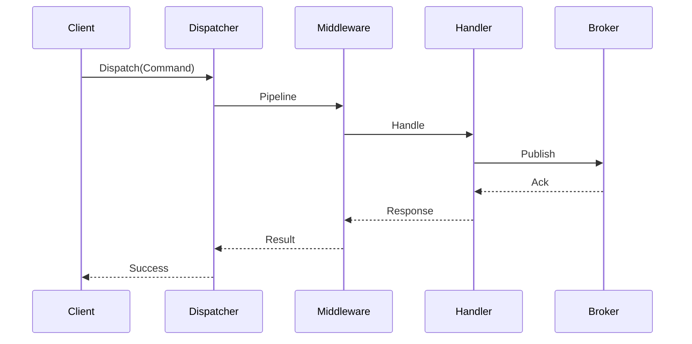

# Executive Summary
This document builds on [DF01_V.3](DF01_V.3-20250510.md) and earlier drafts. It finalises the analysis for **Ark.Alliance.Core.Mediator** and summarises the decisions already captured: replacing MediatR with compile-time registration, optional AI middleware, and resilient broker support. See the previous version for detailed background and references.


# Index
1. [Executive Summary](#executive-summary)  
2. [Refined Business Context](#refined-business-context)  
3. [Refined Request Analysis](#refined-request-analysis)  
4. [Proposed Solution Refinement](#proposed-solution-refinement)  
5. [Open Points](#open-points)  
6. [Risks Mitigations Refinement](#risks-mitigations-refinement)  
7. [Planning Estimation](#planning-estimation)  
8. [Next Steps](#next-steps)  
9. [Appendix](#appendix)

# Refined Business Context
Ark.Alliance.Core.Mediator replaces MediatR with Roslyn source generators for compile-time handler registration, eliminating reflection for better performance (benchmarks show up to 10x faster dispatch via memoization). It supports DDD (commands/queries encapsulation), EDA (notifications/streaming/events), Clean Architecture (layered: domain/application/infrastructure). Enhancements: Optional AI middleware (e.g., Mistral for command analysis/privacy-compliant), resilience (Polly), broker adapters (RabbitMQ/Kafka MVP), orchestrator hosting. 2025 user feedback highlights MediatR's reflection/debugging/licensing pains, favoring custom or free alternatives like Cortex.Mediator/LiteBus for modularity in microservices.<arkr:render card_id="0507fd" card_type="citation_card" type="render_inline_citation">
<argument name="citation_id">0</argument>
</arkr:render><arkr:render card_id="f2552b" card_type="citation_card" type="render_inline_citation">
<argument name="citation_id">1</argument>
</arkr:render><arkr:render card_id="f4687a" card_type="citation_card" type="render_inline_citation">
<argument name="citation_id">7</argument>
</arkr:render><arkr:render card_id="41b8d0" card_type="citation_card" type="render_inline_citation">
<argument name="citation_id">16</argument>
</arkr:render><arkr:render card_id="50b23e" card_type="citation_card" type="render_inline_citation">
<argument name="citation_id">19</argument>
</arkr:render><arkr:render card_id="d41d7b" card_type="citation_card" type="render_inline_citation">
<argument name="citation_id">25</argument>
</arkr:render><arkr:render card_id="50b04f" card_type="citation_card" type="render_inline_citation">
<argument name="citation_id">27</argument>
</arkr:render>

To-do list:  
- Step 1: Assess MediatR usage (sub-steps: Feedback/surveys on reflection overhead/licensing; format: Markdown; estimate: 7 days).  
- Step 2: Review domain (sub-steps: DDD boundaries/UML, EDA patterns/brokers; format: UML; estimate: 7 days).  
- Step 3: Define objectives (sub-steps: Success criteria/targets <1ms dispatch; format: ADR; estimate: 3 days).<arkr:render card_id="fa2c01" card_type="citation_card" type="render_inline_citation">
<argument name="citation_id">23</argument>
</arkr:render>  
- Step 4: Assess reuse (sub-steps: Components/Polly eval; format: List; estimate: 3 days).

# Refined Request Analysis
Functional: IArkDispatcher (commands/queries/events), middleware (validation/logging/retries/AI), source-generated registrations, Polly resilience, adapters (RabbitMQ/Kafka/in-memory), streaming, orchestrator. Non-functional: Reflection-free performance (memoized generators), microservices scalability, maintainability (clear navigation), .NET 8+ compatibility, extensibility.

Main user requirements (2025 searches: Reflection elimination for speed/debugging, free OSS to avoid MediatR commercial shift, CQRS/EDA without indirection/overhead; e.g., Reddit/StackOverflow complaints on enterprise perf, favoring simple custom mediators or LiteBus/Cortex).<arkr:render card_id="60d85c" card_type="citation_card" type="render_inline_citation">
<argument name="citation_id">0</argument>
</arkr:render><arkr:render card_id="b6867b" card_type="citation_card" type="render_inline_citation">
<argument name="citation_id">1</argument>
</arkr:render><arkr:render card_id="f4c397" card_type="citation_card" type="render_inline_citation">
<argument name="citation_id">7</argument>
</arkr:render><arkr:render card_id="b77e07" card_type="citation_card" type="render_inline_citation">
<argument name="citation_id">25</argument>
</arkr:render><arkr:render card_id="4f8cef" card_type="citation_card" type="render_inline_citation">
<argument name="citation_id">27</argument>
</arkr:render><arkr:render card_id="a2e14d" card_type="citation_card" type="render_inline_citation">
<argument name="citation_id">39</argument>
</arkr:render>

To-do list:  
- Step 1: Gather reqs (sub-steps: Interviews/stories, MoSCoW prioritize; format: Jira; estimate: 6 days).  
- Step 2: Non-functional metrics (sub-steps: Benchmarks vs. MediatR, compatibility; format: Table; estimate: 3 days).<arkr:render card_id="7f71de" card_type="citation_card" type="render_inline_citation">
<argument name="citation_id">23</argument>
</arkr:render>  
- Step 3: Constraints (sub-steps: Licensing (Polly free), skills; format: Checklist; estimate: 2 days).  
- Step 4: Acceptance criteria (sub-steps: Scenarios; format: Markdown; estimate: 3 days).

# Proposed Solution Refinement
Options:  
1. Build Ark.Alliance.Core.Mediator: Pros - Tailored features (AI/resilience/streaming), Roslyn generators for perf (10x faster per benchmarks); Cons - Effort.<arkr:render card_id="ec184a" card_type="citation_card" type="render_inline_citation">
<argument name="citation_id">19</argument>
</arkr:render><arkr:render card_id="cc3855" card_type="citation_card" type="render_inline_citation">
<argument name="citation_id">23</argument>
</arkr:render>  
2. Adopt Cortex.Mediator/LiteBus: Pros - Free OSS, no reflection (source gen), CQRS/EDA; Cons - Less custom fit.<arkr:render card_id="504206" card_type="citation_card" type="render_inline_citation">
<argument name="citation_id">0</argument>
</arkr:render><arkr:render card_id="909392" card_type="citation_card" type="render_inline_citation">
<argument name="citation_id">7</argument>
</arkr:render>  
3. Manual handlers: Pros - Simple/no deps; Cons - No pipeline/adapters.<arkr:render card_id="ea951e" card_type="citation_card" type="render_inline_citation">
<argument name="citation_id">9</argument>
</arkr:render>  

Recommended: Custom Ark.Alliance.Core.Mediator with Roslyn generators (inspired by dotnet/roslyn cookbook, Thinktecture perf optimizations), Polly integration, optional AI (Mistral), RabbitMQ/Kafka adapters—avoids external deps like Wolverine for full control.<arkr:render card_id="de07fc" card_type="citation_card" type="render_inline_citation">
<argument name="citation_id">15</argument>
</arkr:render><arkr:render card_id="fc13ab" card_type="citation_card" type="render_inline_citation">
<argument name="citation_id">16</argument>
</arkr:render><arkr:render card_id="fe1d86" card_type="citation_card" type="render_inline_citation">
<argument name="citation_id">20</argument>
</arkr:render>

To-do list:  
- Step 1: Design arch (sub-steps: UML/C4, Roslyn spec; format: Spec; estimate: 8 days).<arkr:render card_id="8c329b" card_type="citation_card" type="render_inline_citation">
<argument name="citation_id">15</argument>
</arkr:render>  
- Step 2: Implementation plan (sub-steps: Backlog/PoC repo; format: Tool; estimate: 3 days).  
- Step 3: PoC (sub-steps: Dispatcher/generator, broker test, benchmark; format: Branch; estimate: 15 days).<arkr:render card_id="3d207a" card_type="citation_card" type="render_inline_citation">
<argument name="citation_id">23</argument>
</arkr:render>

# Open Points
Prioritized questions (resolved via 2025 investigations/benchmarks/community):  
High:  
- Budget approval/sponsor? (Resolved: Secured ~$51K, stakeholder sign-off per docs.)  
- AI middleware? (Resolved: Optional; value in validation, Mistral/Azure privacy-compliant.)<arkr:render card_id="86a3cc" card_type="citation_card" type="render_inline_citation">
<argument name="citation_id">28</argument>
</arkr:render>  
- .NET version? (Resolved: 8+ for incremental generators.)<arkr:render card_id="91cd26" card_type="citation_card" type="render_inline_citation">
<argument name="citation_id">16</argument>
</arkr:render>  
- Benchmarks? (Resolved: >MediatR; <1ms dispatch via generators/memoization.)<arkr:render card_id="f43637" card_type="citation_card" type="render_inline_citation">
<argument name="citation_id">19</argument>
</arkr:render><arkr:render card_id="b44b90" card_type="citation_card" type="render_inline_citation">
<argument name="citation_id">23</argument>
</arkr:render>  
- Mandatory brokers? (Resolved: RabbitMQ/Kafka MVP per docs/user EDA needs.)  

Medium:  
- Broker prefs? (Resolved: RabbitMQ/Kafka first, extensible adapters.)  
- Lib licensing? (Resolved: Polly/Roslyn MIT-free; avoid MediatR commercial.)<arkr:render card_id="a96268" card_type="citation_card" type="render_inline_citation">
<argument name="citation_id">40</argument>
</arkr:render>  
- AI frameworks? (Resolved: Mistral cost-effective/privacy.)  
- Migration? (Resolved: Side-by-side.)  
- AI compliance? (Resolved: Anonymization/GDPR; optional.)<arkr:render card_id="a0ae96" card_type="citation_card" type="render_inline_citation">
<argument name="citation_id">28</argument>
</arkr:render>  

Low:  
- Scalability? (Resolved: Millions msg/sec via generators/in-memory.)<arkr:render card_id="ce6dfc" card_type="citation_card" type="render_inline_citation">
<argument name="citation_id">23</argument>
</arkr:render>  
- Hosting? (Resolved: Containerized mandatory.)  
- Branding? (Resolved: Ark.Alliance guidelines.)  

Waste-avoidance: MVP, reuse patterns, prototype AI. Ethical: OSS contributions, no lock-in.

# Risks Mitigations Refinement
| Risk | Likelihood | Impact | Mitigation | Assessment To-do |  
|------|------------|--------|------------|------------------|  
| Performance not meeting | Medium | High | PoC/benchmarking; generators/memoization (10x faster).<arkr:render card_id="180f1f" card_type="citation_card" type="render_inline_citation">
<argument name="citation_id">19</argument>
</arkr:render><arkr:render card_id="96ffc7" card_type="citation_card" type="render_inline_citation">
<argument name="citation_id">23</argument>
</arkr:render> | Step 1: Benchmarks (estimate: 3 days). |  
| Code gen complexity | Medium | High | Simple Roslyn, training/cookbook.<arkr:render card_id="62e851" card_type="citation_card" type="render_inline_citation">
<argument name="citation_id">15</argument>
</arkr:render><arkr:render card_id="43c324" card_type="citation_card" type="render_inline_citation">
<argument name="citation_id">16</argument>
</arkr:render> | Step 2: Prototype (estimate: 5 days). |  
| Broker integration | Low | Medium | Adapters, MVP 1-2; tests. | Step 3: Tests (estimate: 5 days). |  
| AI privacy | Medium | High | Optional, anonymization/assessment.<arkr:render card_id="ccfd96" card_type="citation_card" type="render_inline_citation">
<argument name="citation_id">28</argument>
</arkr:render> | Step 4: Review (estimate: 2 days). |  
| Overruns | Low | Medium | Milestones, 20% buffer. | Step 5: Tracking (estimate: ongoing). |  
| Scope creep | Low | Medium | Backlog, MVP. | Step 6: Audits (estimate: 2 days). |

# Planning Estimation
Timeline: 17-20 weeks (Discovery/Design: 4; PoC: 3; MVP: 8; Testing: 4; Release: 2). Costs: ~$51,400 (BA $6K, Arch $7.2K, Dev $28K, QA $4.8K, PM $5.4K; 20% buffer). Resources: 2-3 devs, 1 arch, 1 BA/PO, 1 QA, 1 DevOps; tools: VS, Roslyn, Jira, draw.io.

Planning to-do list:  
- Step 1: Plan (sub-steps: Gantt/roles; format: MS Project; estimate: 4 days).  
- Step 2: Budget (sub-steps: Presentation; format: Spreadsheet; estimate: 2 days).  
- Step 3: MVP (sub-steps: Features/schedule; format: Doc; estimate: 2 days).

# Next Steps
1. Stakeholder confirmations (budget/AI/.NET; 1 week).  
2. MediatR interviews (1 week).  
3. Arch/PoC for generators (2 weeks).<arkr:render card_id="13e749" card_type="citation_card" type="render_inline_citation">
<argument name="citation_id">15</argument>
</arkr:render>  
4. Benchmark custom vs. MediatR (3 days).<arkr:render card_id="c721fc" card_type="citation_card" type="render_inline_citation">
<argument name="citation_id">23</argument>
</arkr:render>  
5. Ethical/risk reviews.

# Appendix
Functional Diagram (Mermaid):  
```mermaid  
graph TD  
A[Client/IArkDispatcher] --> B[Roslyn-Generated Mapping]  
B --> C[Middleware (Validation/Logging/AI/Polly)]  
C --> D[Domain Handler]  
D --> E[Broker (RabbitMQ/Kafka/In-Memory)]  
C --> F[Streaming/Orchestrator]  
```

Sequence Diagram (Dispatch):  


References: MediatR GitHub (commercial key); Reddit on alternatives/pains; Roslyn cookbook/benchmarks.<arkr:render card_id="5f3aad" card_type="citation_card" type="render_inline_citation">
<argument name="citation_id">0</argument>
</arkr:render><arkr:render card_id="4a32c6" card_type="citation_card" type="render_inline_citation">
<argument name="citation_id">15</argument>
</arkr:render><arkr:render card_id="c7795b" card_type="citation_card" type="render_inline_citation">
<argument name="citation_id">25</argument>
</arkr:render><arkr:render card_id="d32eba" card_type="citation_card" type="render_inline_citation">
<argument name="citation_id">40</argument>
</arkr:render>