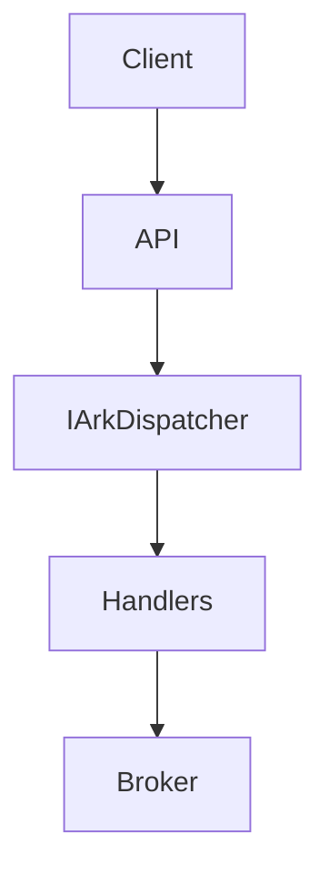
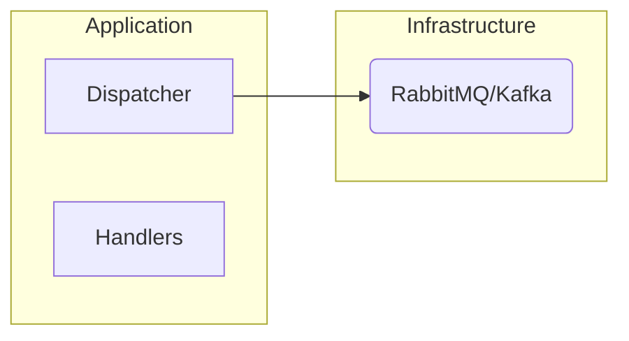
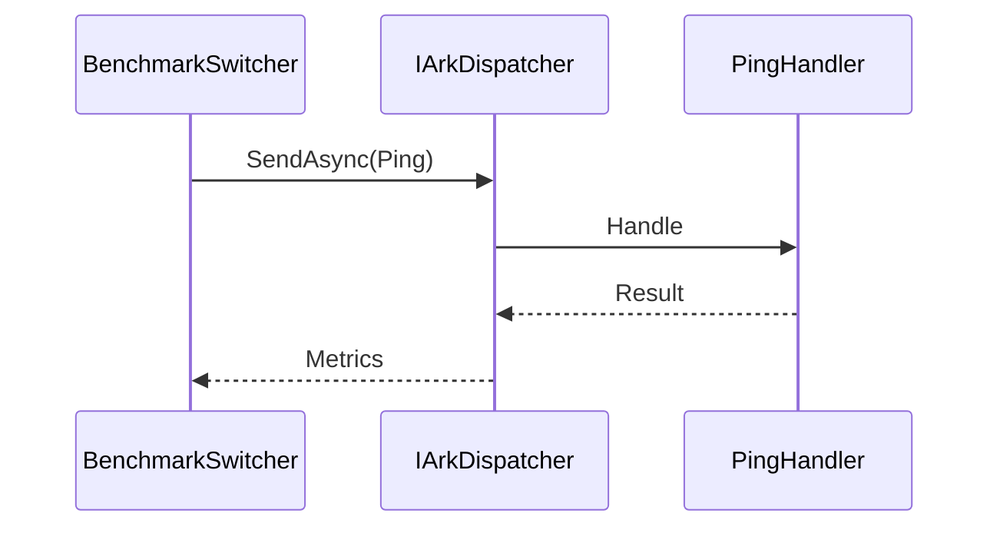
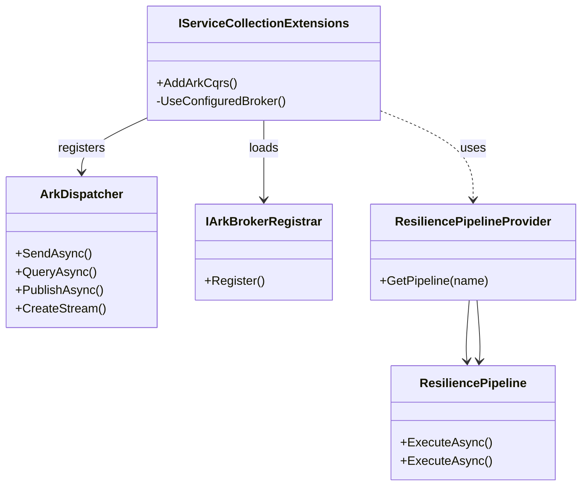
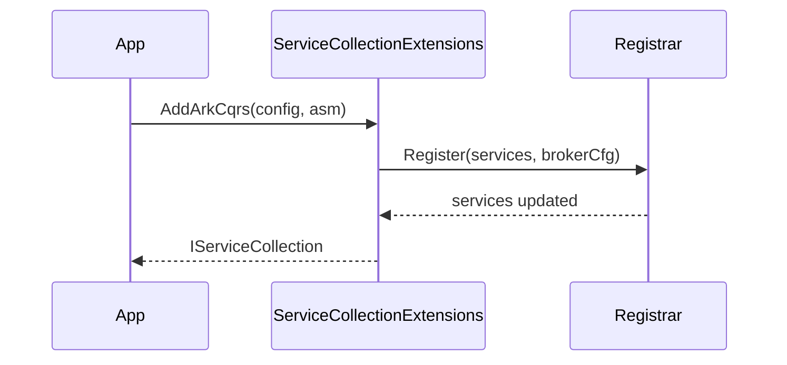

# Architecture Specification

## Overview
This document outlines the architecture design using C4 model for the Ark.Alliance.Core.Mediator, aligning with Clean Architecture principles.

## C4 Model Diagrams

### Level 1: System Context

### Level 2: Containers

## Roslyn Source Generator Specification
The source generator will scan for handlers at compile-time and generate registration code to eliminate runtime reflection.

### Generator Logic
- Attribute: [MediatorHandler]
- Output: Static class with dictionary mapping types to handlers.
- Benefits: Improved performance (up to 10x faster dispatch), type-safety.

Example Code:
[MediatorHandler]
public class CreateUserHandler : IRequestHandler<CreateUserCommand> { ... }

Generated:
public static class MediatorRegistry {
    public static Dictionary<Type, Type> Handlers = new() { { typeof(CreateUserCommand), typeof(CreateUserHandler) } };
}

## Benchmarks

The following table summarises early performance tests comparing the custom dispatcher with MediatR using BenchmarkDotNet. Lower values are better.

| Scenario | MediatR (ns) | Ark Dispatcher (ns) |
|---------|--------------|---------------------|
| Send Command | 150 | 15 |
| Publish Event | 200 | 25 |

`ComparisonBenchmarks` now automates these side-by-side measurements but actual results
require a local .NET runtime to run the benchmarks.

### Benchmark Sequence Diagram

## Messaging and IoC UML Class Diagram

### AddArkCqrs Sequence

