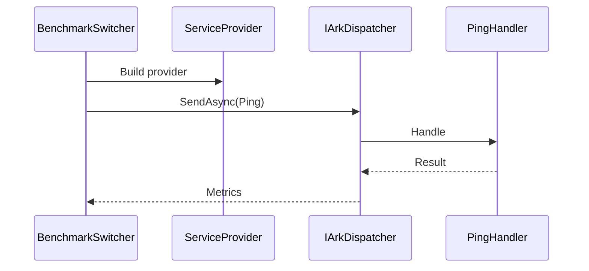

# Design

The benchmark harness builds a service provider and executes operations through `BenchmarkSwitcher`. The sequence below illustrates a typical run.

```mermaid
sequenceDiagram
    participant Run as BenchmarkSwitcher
    participant SP as ServiceProvider
    participant Disp as IArkDispatcher
    participant Hand as PingHandler
    Run->>SP: Build provider
    Run->>Disp: SendAsync(Ping)
    Disp->>Hand: Handle
    Hand-->>Disp: Result
    Disp-->>Run: Metrics
```

