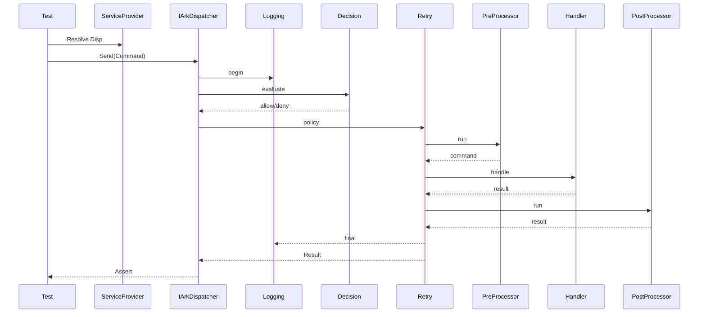
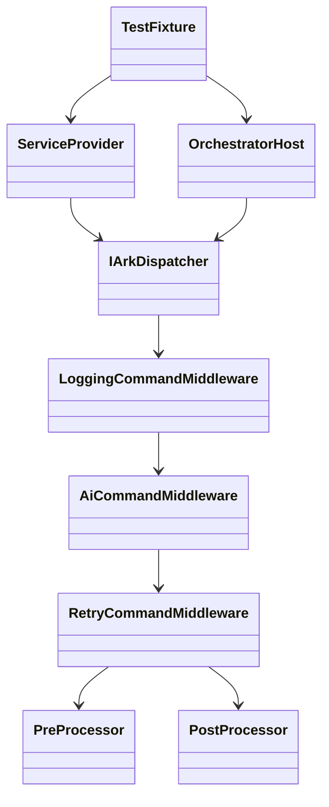

# Design

The tests follow Arrange‑Act‑Assert. Fixtures configure a fresh `ServiceProvider` for each scenario. A simplified UML sequence diagram illustrates a typical test flow.

Pre- and post-processors allow modification of the command and resulting `Result` after the retry logic executes. This design mirrors the production pipeline so tests reflect real usage scenarios.
