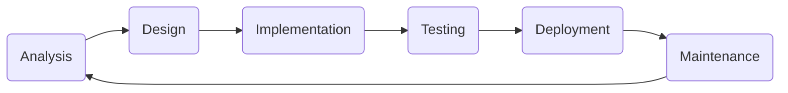

# SDLC Overview : ArkAllianceEcosystem

## Introduction
This folder documents the Software Development Life Cycle for the Ark Alliance projects. It outlines how the solution improves on common mediator patterns by removing reflection and adding built‑in logging while staying MIT licensed. The documents follow DDD, Event‑Driven Architecture and Clean Architecture principles to ensure predictable and maintainable deliveries. Each subfolder contains a README covering specific phases such as [Analysis](01_Analysis/README.md), [Design](02_Design/README.md), [Implementation](03_Implementation/README.md) and [Testing](04_Testing/README.md).

For an overview of the runtime libraries and benchmarks see the [root README](../README.md). These SDLC files track requirements and tasks so the solution evolves consistently with its architectural goals. Ongoing documentation tasks are tracked in [TodoList](TodoList.md).

## Index
1. [Phases](#phases)
2. [Life Cycle Diagram](#life-cycle-diagram)
3. [Folder Structure](#folder-structure)
4. [Samples](#samples)
5. [Overall To-Do](#overall-to-do)
6. [Task Tracker](TodoList.md)
7. [Testcontainers Guide](04_Testing/testcontainers_dotnet_9.Md)
8. [Testcontainers Troubleshooting](04_Testing/testcontainers_troubleshooting_procedure.md)
9. [Issues Log](Issues.md)

## Phases
The life cycle is divided into six standard stages:
1. **Analysis** – gather requirements and assess feasibility.
2. **Design** – create high‑level and detailed designs.
3. **Implementation** – build code and integrate third‑party packages.
4. **Testing** – validate the solution against requirements.
5. **Deployment** – release to the target environment.
6. **Maintenance** – monitor and evolve after release.

## Life Cycle Diagram


## Folder Structure
```text
_SDLC/
  00_Planning/       # backlog and planning material
  00_Prerequisites/  # environment setup
  01_Analysis/       # requirements and functional analysis
  02_Design/         # architecture and design documents
  03_Implementation/ # source packages and build scripts
  04_Testing/        # QA artifacts
  05_Deployment/     # deployment configuration
  06_Maintenance/    # post-release notes
```
Each folder contains a README describing its purpose and a table of open tasks.

## Samples
An example console application is provided under
`Ark.Alliance.Core.Mediator/Samples/StreamingLoggingSample`. Its documentation is now consolidated in
[`Samples/StreamingLoggingSample`](Samples/StreamingLoggingSample).
These documents demonstrate how logging and retry middleware work with
streaming handlers and complement the analysis and design in this folder.

The source generator project provides its own SDLC notes in
[`Ark.Alliance.Core.Mediator.Generators/_Sdlc`](../Ark.Alliance.Core.Mediator/Ark.Alliance.Core.Mediator.Generators/_Sdlc).
They detail the build-time handler registration logic along with UML diagrams
and test plans.
The xUnit test suite also includes dedicated documentation in
[Ark.Alliance.Core.Mediator.Tests.md](Ark.Alliance.Core.Mediator.Tests.md).

Benchmark notes for dispatcher performance live in
`01_Analysis/Ark_Alliance_Core_Mediator_Benchmarks_Analysis.md` and the related
design, implementation and testing files. The prior `_SDLC` folder under the
benchmarks project has been consolidated here so all documentation is
centrally located.

## Overall To-Do
| ID | Description | Status |
|----|-------------|--------|
| 4 | Extend unit tests for middleware and orchestrator | **Done** |
| 5 | Implement broker adapters and integration tests | Open |
| 6 | Complete design docs with diagrams and benchmarks | Closed |
| 8 | Remove reflection in streaming and broker registration | Open |
| 10 | Benchmark dispatch vs. MediatR | Closed |
| 13 | Finalize orchestrator documentation | Closed |
| 16 | Review IoC namespaces for DDD compliance | In Progress |
| 20 | Style and security audit | Open |
| 23 | Per-service logging toggle | Open |
| 25 | Document benchmark and test READMEs | Closed |
| 24 | Review IoC and Messaging documentation | Closed |
| 27 | Add RetryCount and InstanceCount options to orchestrator | Done |
| 28 | Handle open generic handler registration failure in tests | Closed |
| S1 | Containerized run instructions for sample | Done |
| S2 | Demonstrate custom middleware usage in sample | Done |
| S3 | Add automated console output test for sample | Done |
| S4 | Publish sample image to container registry | Open |
| ML1 | Design middleware to log command and query data with sampling and encryption | **Done** | Implemented with AES‑256 and per-command sampling. |
| ML2 | Document ingestion pipeline using Event Hubs and Data Lake | **Done** | Bicep template and instructions added in `05_Deployment/ML`. |
| ML3 | Provide deployment automation for ML services | Planned | Helm charts for inference API and vector store. |

## Release
- 2025-07-21 Initial SDLC documentation added.
