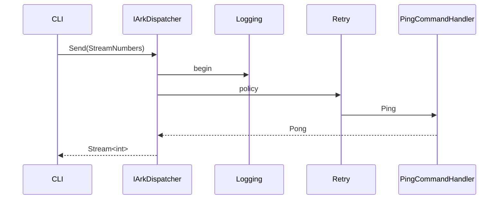
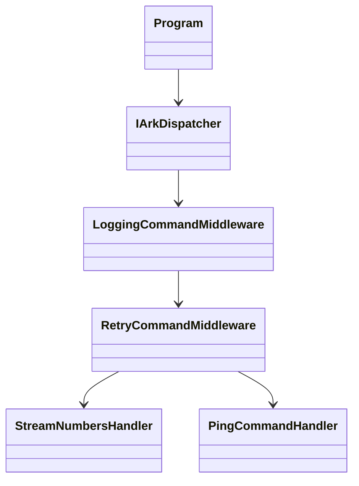

# Design

A simple command triggers a streaming handler while logging and retry middleware write to the console and handle transient faults.

The application can run inside a container using the provided Dockerfile to mirror deployment environments.
